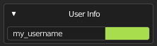
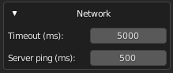
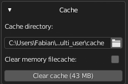
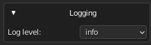
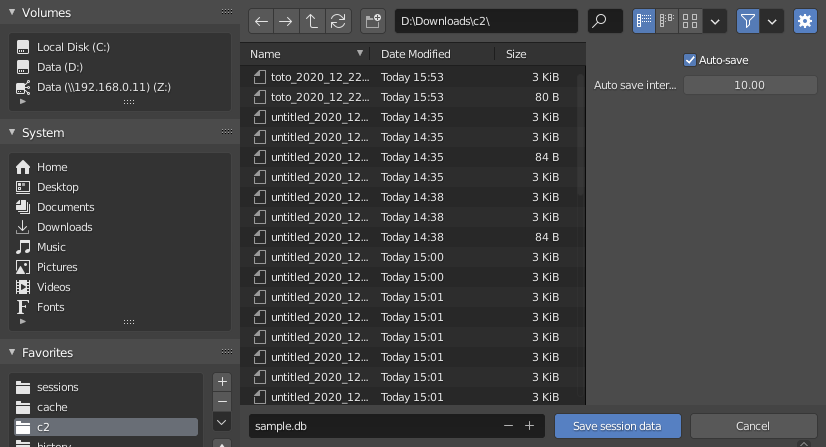
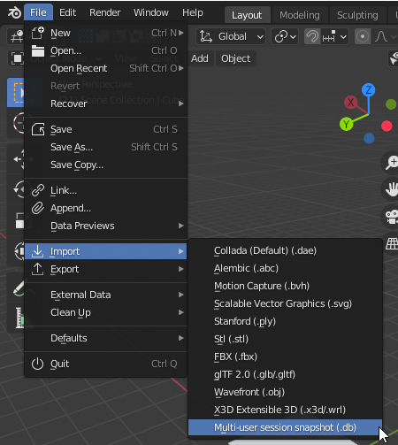

################
General Settings
################

This section contains optional settings to configure before a session.

.. figure:: img/sidepannel_general_settings.png
   :align: center
   
   General Settings pannel

---------
User info
---------

   User Info settings

The **User Info** pannel is here to change your user name and use color.

-------
Network
-------

   Network settings

**Timeout (in milliseconds)** is the maximum ping authorized before auto-disconnecting.
You should only increase it if you have a bad connection.

-----
Cache
-----

   Cache settings

Multi-user allows you to replicate external dependencies such as images (textures, hdris, etc...), movies, and sounds. 
On each client, the files will be stored in the multi-user cache folder.

**Cache directory** choose where cached files (images, sound, movies) will be saved.

**Clear memory filecache** will save memory space at runtime by removing the file content from memory as soon as it has been written to the disk.

**Clear cache** will remove all files from the cache folder. 

.. warning:: Clearing the cache could break your scene images/movies/sounds if they are used in a blend file! Try saving the blend file and choosing 'Pack all into blend' before clearing the cache.

-------
Logging
-------

   Advanced log settings

**log level** allows you to set the level of detail captured in multi-user's logging output. Here is a brief description on the level of detail for each value of the logging parameter:

+-----------+-----------------------------------------------+
| Log level |                  Description                  |
+===========+===============================================+
| ERROR     | Shows only critical errors                    |
+-----------+-----------------------------------------------+
| WARNING   | Shows only errors (of all kinds)              |
+-----------+-----------------------------------------------+
| INFO      | Shows only status-related messages and errors |
+-----------+-----------------------------------------------+
| DEBUG     | Shows all possible information                |
+-----------+-----------------------------------------------+

-----------------
Save session data 
-----------------

.. danger::
   This is an experimental feature, it is still recommended to use regular .blend save.

The save session data allows you to create a backup of the session data.

When you hit the **save session data** button, the following popup dialog will appear.
It allows you to choose the destination folder and if you want to run an auto-save.

   Save session data dialog.

If you enabled the auto-save option, you can cancel it from the **Cancel auto-save** button.

.. figure:: img/quickstart_save_session_data_cancel.png
   :align: center

   Cancel session autosave.

To import session data backups, use the following **Multiuser session snapshot** import dialog

   Import session data dialog.

.. note::
   It is not yet possible to start a session directly from a backup.

.. _advanced:
