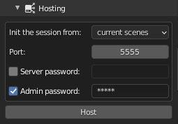

.. _how-to-host:

How to host a session
=====================
------------
Local server
------------

The multi-user add-on relies on a Client-Server architecture. 
The server is the heart of the collaborative session.
It is what allows user's blender instances to communicate with each other.  
In simple terms, *Hosting a session* means *run a local server and connect the local client to it*. 
When we say **local server** we mean a server which is accessible from the LAN (Local Area Network) without requiring an internet connection. 

.. _local-setup:

When the hosting process starts, the multi-user addon will launch a local server instance.
In the **Hosting** panel configure your server according to:

   Hosting panel

* **Init the session from**: the session initialisation method.
  
  * **current scenes**: start with the data loaded in the current blend file.
  * **an empty scene**: clear the blend file's data and start over.
  
* **Port**: port on which the server is listening.
* **Server password**: (*optional*) the server password.
* **Admin password**: (*optional*) the session administration password.

Once everything is set up, you can hit the **Host** button to launch the session!

This will do two things:

* Start a local server 
* Connect you to it as an :ref:`admin`

.. danger::
   By starting from an empty scene, all of the blend data will be removed!
   Be sure to save your existing work before launching the session.

-------------
Online server
-------------

However, there are times when you will need to host a session over the internet.
In this case, we strongly recommend that you read the :ref:`internet-guide` tutorial.

During an online session, various actions are available to you, go to :ref:`how-to-manage` section to 
learn more about them.