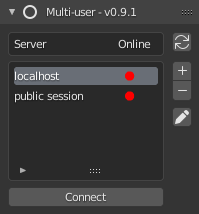
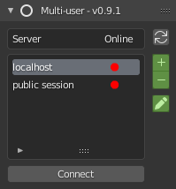
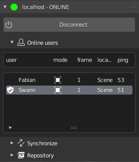
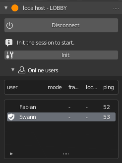

.. _how-to-join:

How to join a session
=====================

This section describes how to join a launched session. 
Before starting make sure that you have access to the session **IP address**, **port number** and that you have filled in your **user information** (name and color).

-----------
Server List
-----------

The server list allows you to manage your servers:

    Server List

To connect to a server, select the one you want to join in the list and click on **Connect**.

To know if the server you want to join is online, you can refresh your server list with the button on the top right corner. 
Online status:

- **Red**: server is offline
- **Green**: server is online

.. note:: 

   If a server is secured with a password, a lock will be displayed next to the server name. You first need to enter the password of the server in its preset to join it.

   .. figure:: img/quickstart_serverlist_private.png
    :align: center
    :width: 200px

It is possible to **add**, **delete** and even **modify** a **server preset** with the buttons located on the top right of the server list:

    Add, Remove, Edit Server Preset

.. note:: 

   Two server presets are already present when the addon is launched:

   - The 'localhost' preset, to join a local session quickly
   - The 'public session' preset, to join the public sessions of the multi-user server (official discord to participate : https://discord.gg/aBPvGws)

-------------------
Add a Server Preset
-------------------

To add a server, you must first register it in the server list. Click on the **+** icon and fill in the window with the server settings: 

.. figure:: img/quickstart_server_edit.png
    :align: center
    :width: 350px

    Server Preset pop-up

- **Server name**: the name of the server.
- **IP**: the host's IP address.
- **Port**: the host's port number.
- **Server password**: (*optional*) the server password.
- **Admin password**: (*optional*) the session administration password.

Once you've configured every field, you can save the server preset by clicking **OK**.
You can now select it in the server list to join the session !

.. warning:: Be careful, if you don't rename your new preset, or if it has the same name as an existing preset, the old preset will be overwritten.

    .. figure:: img/server_preset_image_report.png
        :align: center
        :width: 200px

----------------
Joining a server
----------------

CONNECT
-------

When joining a server that have already be initialise, the session status screen will be **CONNECT**.
You are now connected and can start creating.

   In session

During an online session, various actions are available to you. Go to :ref:`how-to-manage` to 
learn more about them.

LOBBY
-----

When starting a **dedicated server**, the session status screen will take you to the **LOBBY** (see side-panel header).

If the session status is set to **LOBBY** and you are a regular user, you need to wait for the admin to launch the scene (admins have shield next to their names).
If you are the admin, you just need to initialise the session to start it (see image below).

   Session initialisation for dedicated server