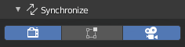
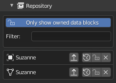

.. _how-to-manage:

How to manage a session
=======================

The quality of a collaborative session directly depends on the quality of the network connection, and the communication between the users. This section describes
various tools which have been made in an effort to ease the communication between your fellow creators.
Feel free to suggest any ideas for communication tools `here <https://gitlab.com/slumber/multi-user/-/issues/75>`_ .

--------------------
Monitor online users
--------------------

One of the most vital tools is the **Online user panel**. It lists all connected
users' information including your own:

* **Role** : admin/regular user.
* **Username** : name of the user.
* **Mode** : user's active mode (object, sculpt, paint,etc.).
* **Frame**: on which frame the user is working.
* **Location**: where the user is actually working.
* **Ping**: user's connection delay in milliseconds.

.. figure:: img/quickstart_users.png
   :align: center

   Online user panel

By selecting a user in the list you'll have access to different users' related **actions**.
Those operators allow you to experience the selected user's state in two different dimensions: **SPACE** and **TIME**.

Snapping in space
-----------------

The **CAMERA button** (Also called **snap view** operator) allow you to snap to 
the user's viewpoint. To disable the snap, click on the button once again. This action 
serves different purposes such as easing the review process, and working together on a large or populated world.

.. hint::
   If the target user is located in another scene, the **snap view** operator will send you to their scene. 

.. figure:: img/quickstart_snap_camera.gif
   :align: center

   Snap view in action

Snapping in time
----------------

The **CLOCK button** (Also called **snap time** operator) allows you to snap to 
the user's time (current frame). To disable the snap, click on the button once again. 
This action helps various multiple creators to work in the same time-frame 
(for instance multiple animators).

.. figure:: img/quickstart_snap_time.gif
   :align: center

   Snap time in action

Kick a user
-----------

.. warning:: Only available for :ref:`admin` !

The **CROSS button** (Also called **kick** operator) allows the administrator to kick the selected user. This can be helpful if a user is acting unruly, but more importantly, if they are experiencing a high ping which is slowing down the scene. Meanwhile, in the target user's world, the session will properly disconnect.

---------------------------
Change replication behavior
---------------------------

During a session, multi-user will replicate all of your local modifications to the scene, to all other users' blender instances.
In order to avoid annoying other users when you are experimenting, you can flag some of your local modifications to be ignored via 
various flags present at the top of the panel (see red area in the image below). Those flags are explained in the :ref:`replication` section.

      Session replication flags

-----------
Manage data
-----------

In order to understand replication data managment, a quick introduction to the multi-user data workflow is in order.
The first thing to know: until now, the addon relies on data-based replication. In simple words, it means that it replicates
the resultant output of a user's actions. 
To replicate datablocks between clients, multi-user relies on a standard distributed architecture:

- The server stores the "master" version of the work.
- Each client has a local version of the work.

When an artist modifies something in the scene, here is what is happening in the background:

1. Modified data are **COMMITTED** to the local repository.
2. Once committed locally, they are **PUSHED** to the server
3. As soon as the server receives updates, they are stored locally and pushed to every other client

At the top of this data management system, a rights management system prevents 
multiple users from modifying the same data at the same time. A datablock may belong to
a connected user or be under :ref:`common-right<**COMMON**>` rights. 

.. note::
   In a near future, the rights management system will support roles to allow multiple users to 
   work on different aspects of the same datablock.

The Repository panel (see image below) allows you to monitor, change datablock states and rights manually.

   Repository panel

The **show only owned** flag allows you to see which datablocks you are currently modifying.

.. warning::
   If you are editing a datablock not listed with this flag enabled, it means that you have not been granted the rights to modify it. 
   So, it won't be updated to other clients! 

Here is a quick list of available actions: 

+---------------------------------------+-------------------+------------------------------------------------------------------------------------+
| icon                                  | Action            | Description                                                                        |
+=======================================+===================+====================================================================================+
| .. image:: img/quickstart_push.png    |  **Push**         | push data-block to other clients                                                   |
+---------------------------------------+-------------------+------------------------------------------------------------------------------------+
| .. image:: img/quickstart_pull.png    | **Pull**          | pull last version into blender                                                     |
+---------------------------------------+-------------------+------------------------------------------------------------------------------------+
| .. image:: img/quickstart_refresh.png | **Reset**         | Reset local change to the server version                                           |
+---------------------------------------+-------------------+------------------------------------------------------------------------------------+
| .. image:: img/quickstart_unlock.png  | **Lock/Unlock**   | If locked, does nothing. If unlocked, grant modification rights to another user.   |
+---------------------------------------+-------------------+------------------------------------------------------------------------------------+
| .. image:: img/quickstart_remove.png  |  **Delete**       | Remove the data-block from network replication                                     |
+---------------------------------------+-------------------+------------------------------------------------------------------------------------+