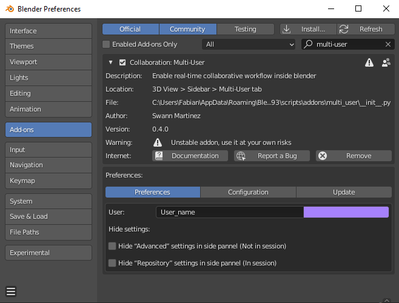

=====================
Installing Multi-User
=====================

Multi-User is often updated. You can keep up to date with the latest changes through the release notes on our `Discord Server <https://discord.com/invite/aBPvGws>`_.

Download
========

`Stable Release <https://gitlab.com/slumber/multi-user/-/jobs/artifacts/master/download?job=build>`__
    **Recommended**. A package packed with the latest features and is considered stable without regressions.

`Latest Release <https://gitlab.com/slumber/multi-user/-/jobs/artifacts/develop/download?job=build>`__
    **Experimental**. A package updated almost daily to include the newest changes in development.
    These versions are not as thoroughly tested as the stable release, and might break.

Install
=======

.. hint::
    The process is the same for linux, mac and windows.

1. Download the addon zip file
2. Run blender as administrator (to allow python dependencies auto-installation).
3. Install **multi-user.zip** from your addon preferences (Edit >> Preferences >> Add-ons >> Install).

    The Addon Preferences Pannel

Once the addon is succesfully installed, we strongly recommend you to follow the :ref:`quickstart`
tutorial.

.. toctree::
    :maxdepth: 1