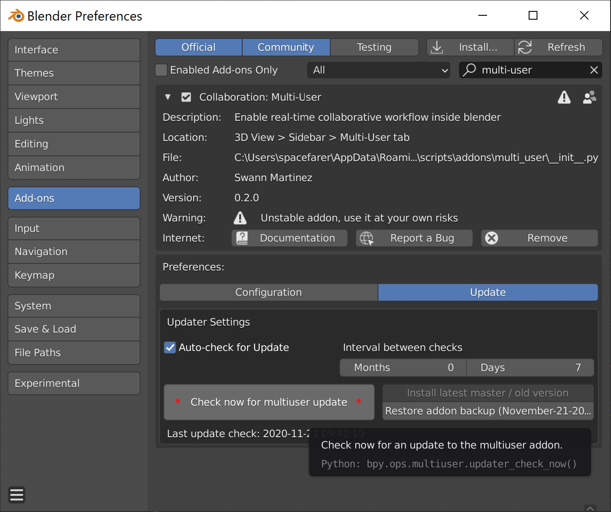
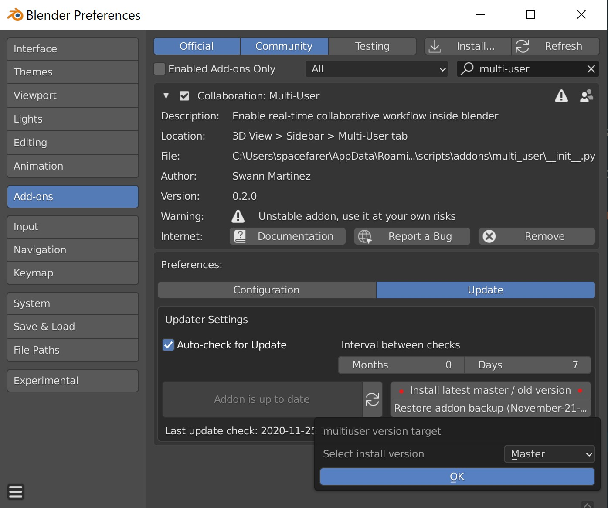
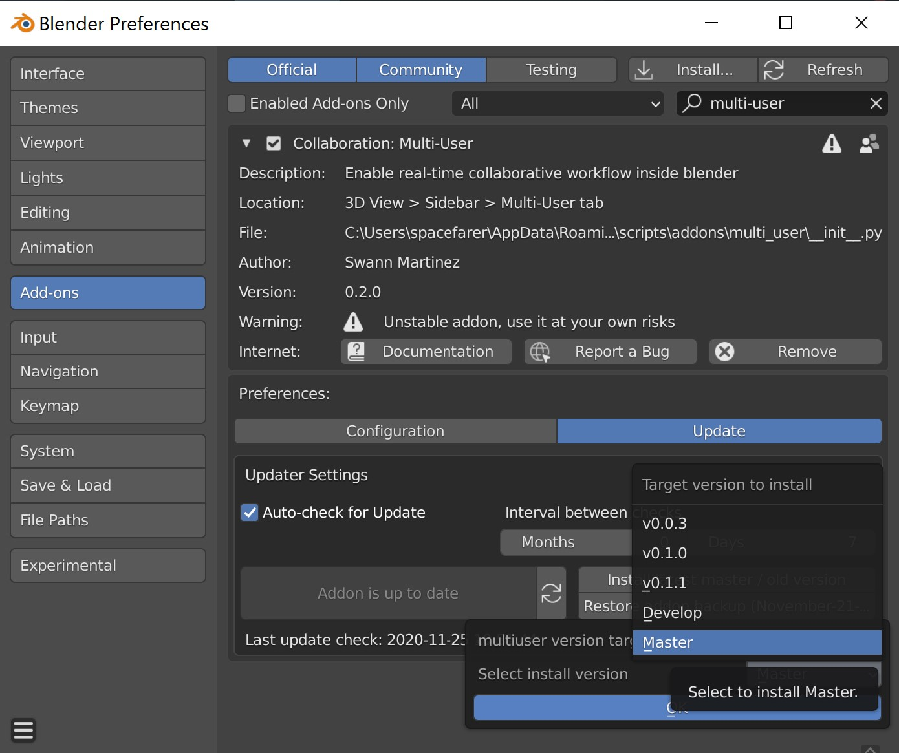
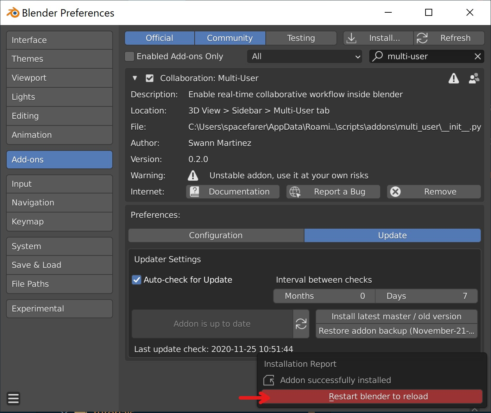

============
Installation
============

.. hint::
    The process is the same for linux, mac and windows.

1. Download `LATEST build <https://gitlab.com/slumber/multi-user/-/jobs/artifacts/develop/download?job=build>`_ or `STABLE build <https://gitlab.com/slumber/multi-user/-/jobs/artifacts/master/download?job=build>`_.
2. Run blender as administrator (to allow python dependencies auto-installation).
3. Install **multi-user.zip** from your addon preferences.

Once the addon is succesfully installed, I strongly recommend you to follow the :ref:`quickstart`
tutorial.

.. _update-version:

Updates
=======

Multi-User has a built-in auto-update function.

1. Navigate to Edit >> Preferences pane in Blender, and go to the 'Add-ons' section.
2. Search 'multi-user', select the 'Update' tab, click 'Auto-check for Update' and choose the frequency you'd like.
3. Make sure to click the three bars in the bottom-left, and save this to your preferences (userpref.blend).

Sometimes you'd like to perform manual update, or even side-grade or rollback your multi-user version. Perhaps you are trying out new features from the 'develop' branch in a test session.

1. Click on 'Check now for multiuser update'. Multi-user will now find new versions

    Check for updates

2. Select 'Install latest master / old version'

    Install

3. In most cases, select 'master' branch for the latest stable release. The unstable 'develop' branch and older releases are available

    Select version

4. Finally, restart blender to use the updated version

    Restart blender