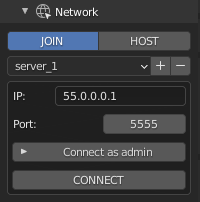
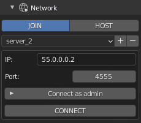
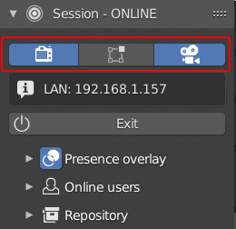
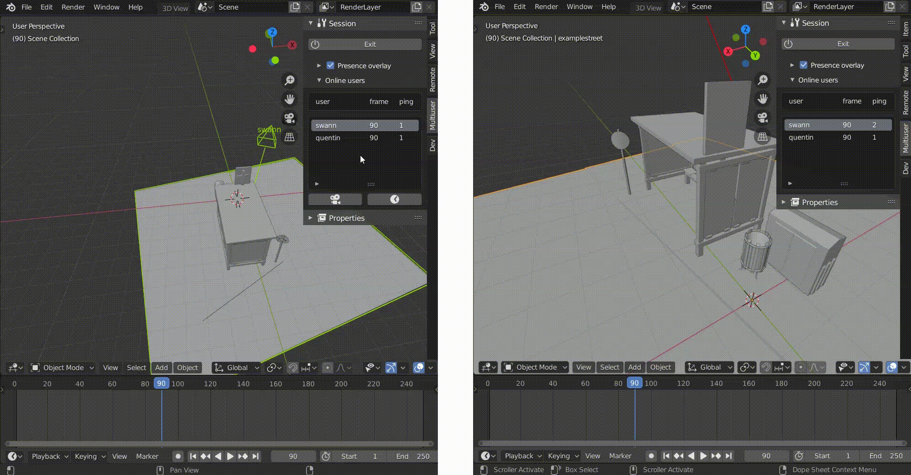
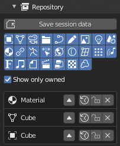
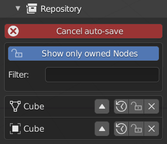
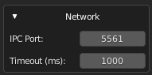
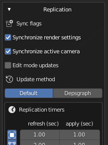
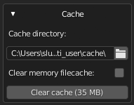
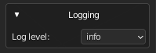

.. _quickstart:

===========
Quick start
===========

.. hint::
   *All session-related settings are located under: `View3D -> Sidebar -> Multiuser panel`*

The multi-user addon provides a session management system.
In this guide, you will quickly learn how to use the collaborative session management system in three parts:

- :ref:`how-to-host`
- :ref:`how-to-join`
- :ref:`how-to-manage`

First launch
============

Welcome to the Multi-User manual.
You will find here all the documentation necessary for the good use of the addon: :ref:`index-manual`

First of all, let's have a quick look at the Multi-User features.

Username and color
------------------

When you launch the addon for the first time you can find this panel in the Sidebar of your View3D:

.. figure:: img/first_time_menu.png
   :align: center

1. Choose a **name** and a **color** that will be specific to you and that will allow others to identify you easily once in session. Don't worry, they can be changed at any time in *Edit >> Prerecences >> Add-ons >> Multi-user*.
2. Press **Continue**

Server list
-----------

.. _how-to-host:

How to host a session
=====================

The multi-user add-on relies on a Client-Server architecture. 
The server is the heart of the collaborative session.
It is what allows user's blender instances to communicate with each other.  
In simple terms, *Hosting a session* means *run a local server and connect the local client to it*. 
When I say **local server** I mean a server which is accessible from the LAN (Local Area Network) without requiring an internet connection. 

However, there are times when you will need to host a session over the internet.
In this case, I strongly recommend that you read the :ref:`internet-guide` tutorial.

.. _user-info:

--------------------------------
1. Fill in your user information
--------------------------------

The **User Info** panel (See image below) allows you to customise your online identity.

.. figure:: img/quickstart_user_info.png
   :align: center

   User info panel

Let's fill in those two fields:

- **name**: your online name.
- **color**: a color used to represent you in other users' workspaces (see image below).

During online sessions, other users will see your selected object and camera highlighted in your profile color.

.. _user-representation:

.. figure:: img/quickstart_user_representation.png
   :align: center

   User viewport representation aka 'User Presence'

---------------------
2. Set up the network
---------------------

When the hosting process starts, the multi-user addon will launch a local server instance.
In the network panel, select **HOST**.
The **Host sub-panel** (see image below) allows you to configure the server according to:

* **Port**: Port on which the server is listening.
* **Start from**: The session initialisation method.

   * **current scenes**: Start with the data loaded in the current blend file.
   * **an empty scene**: Clear the blend file's data and start over.
   
   .. danger::
      By starting from an empty scene, all of the blend data will be removed!
      Be sure to save your existing work before launching the session.

* **Admin password**: The session administration password.

.. figure:: img/quickstart_host.png 
   :align: center
   :alt: host menu

   Host network panel

.. note:: Additional configuration setting can be found in the :ref:`advanced` section.

Once everything is set up, you can hit the **HOST** button to launch the session!

This will do two things:

* Start a local server 
* Connect you to it as an :ref:`admin`

During an online session, various actions are available to you, go to :ref:`how-to-manage` section to 
learn more about them.

.. _how-to-join:

How to join a session
=====================

This section describes how join a launched session. 
Before starting make sure that you have access to the session IP address and port number.

--------------------------------
1. Fill in your user information
--------------------------------

Joining a server 
=======================

--------------
Network setup
--------------

In the network panel, select **JOIN**.
The **join sub-panel** (see image below) allows you to configure your client to join a
collaborative session which is already hosted.

    Connection pannel

Fill in the fields with your information:

- **IP**: the host's IP address.
- **Port**: the host's port number.

Once you've configured every field, hit the button **CONNECT** to join the session !
When the :ref:`session-status` is **ONLINE** you are online and ready to start co-creating.

.. note::
   
   If you want to have **administrator rights** (see :ref:`admin` ) on the server, just enter the password created by the host in the **Connect as admin** section

    .. figure:: img/server_preset_image_admin.png
        :align: center
        :width: 200px

        Admin password

---------------
Server presets
---------------

You can save your server presets in a preset list below the 'JOIN' and 'HOST' buttons. This allows you to quickly access and manage your servers.

To add a server, first enter the ip address and the port (plus the password if needed), then click on the + icon to add a name to your preset. To remove a server from the list, select it and click on the - icon.

.. warning:: Be careful, if you don't rename your new preset, or if it has the same name as an existing preset, the old preset will be overwritten.

    .. figure:: img/server_preset_image_report.png
        :align: center
        :width: 200px

.. note:: 
   
   Two presets are already present when the addon is launched:

  - The 'localhost' preset, to host and join a local session quickly
  - The 'public session' preset, to join the public sessions of the multi-user server (official discord to participate : https://discord.gg/aBPvGws)

.. note::
   Additional configuration settings can be found in the :ref:`advanced` section.

.. note::
   When starting a **dedicated server**, the session status screen will take you to the **LOBBY**, awaiting an admin to start the session.

   If the session status is set to **LOBBY** and you are a regular user, you need to wait for the admin to launch the scene.
   If you are the admin, you just need to initialise the repository to start the session (see image below).

   .. figure:: img/quickstart_session_init.png
      :align: center

      Session initialisation for dedicated server

During an online session, various actions are available to you. Go to :ref:`how-to-manage` to 
learn more about them.

.. _how-to-manage:

How to manage a session
=======================

The quality of a collaborative session directly depends on the quality of the network connection, and the communication between the users. This section describes
various tools which have been made in an effort to ease the communication between your fellow creators.
Feel free to suggest any ideas for communication tools `here <https://gitlab.com/slumber/multi-user/-/issues/75>`_ .

---------------------------
Change replication behavior
---------------------------

During a session, multi-user will replicate all of your local modifications to the scene, to all other users' blender instances.
In order to avoid annoying other users when you are experimenting, you can flag some of your local modifications to be ignored via 
various flags present at the top of the panel (see red area in the image below). Those flags are explained in the :ref:`replication` section.

      Session replication flags

--------------------
Monitor online users
--------------------

One of the most vital tools is the **Online user panel**. It lists all connected
users' information including your own:

* **Role** : if a user is an admin or a regular user.
* **Username** : Name of the user.
* **Mode** : User's active editing mode (edit_mesh, paint,etc.).
* **Frame**: When (on which frame) the user is working.
* **Location**: Where the user is actually working.
* **Ping**: user's connection delay in milliseconds

.. figure:: img/quickstart_users.png
   :align: center

   Online user panel

By selecting a user in the list you'll have access to different users' related **actions**.
Those operators allow you to experience the selected user's state in two different dimensions: **SPACE** and **TIME**.

Snapping in space
-----------------

The **CAMERA button** (Also called **snap view** operator) allow you to snap to 
the user's viewpoint. To disable the snap, click on the button once again. This action 
serves different purposes such as easing the review process, and working together on a large or populated world.

.. hint::
   If the target user is located in another scene, the **snap view** operator will send you to their scene. 

.. figure:: img/quickstart_snap_view.gif
   :align: center

   Snap view in action

Snapping in time
----------------

The **CLOCK button** (Also called **snap time** operator) allows you to snap to 
the user's time (current frame). To disable the snap, click on the button once again. 
This action helps various multiple creators to work in the same time-frame 
(for instance multiple animators).

   Snap time in action

Kick a user
-----------

.. warning:: Only available for :ref:`admin` !

The **CROSS button** (Also called **kick** operator) allows the administrator to kick the selected user. This can be helpful if a user is acting unruly, but more importantly, if they are experiencing a high ping which is slowing down the scene. Meanwhile, in the target user's world, the session will properly disconnect.

Change users display 
--------------------

Presence is the multi-user module responsible for displaying user presence. During the session,
it draw users' related information in your viewport such as:

* Username
* User point of view
* User active mode
* User selection

.. figure:: img/quickstart_presence.png
   :align: center

   Presence show flags

The presence overlay panel (see image above) allows you to enable/disable 
various drawn parts via the following flags:

- **Show session status**: display the session status in the viewport 
   
   .. figure:: img/quickstart_status.png
      :align: center

   - **Text scale**: session status text size
   - **Vertical/Horizontal position**: session position in the viewport
   
- **Show selected objects**: display other users' current selections
- **Show users**: display users' current viewpoint 
- **Show different scenes**: display users working on other scenes

-----------
Manage data
-----------

In order to understand replication data managment, a quick introduction to the multi-user data workflow is in order.
The first thing to know: until now, the addon relies on data-based replication. In simple words, it means that it replicates
the resultant output of a user's actions. 
To replicate datablocks between clients, multi-user relies on a standard distributed architecture:

- The server stores the "master" version of the work.
- Each client has a local version of the work.

When an artist modifies something in the scene, here is what is happening in the background:

1. Modified data are **COMMITTED** to the local repository.
2. Once committed locally, they are **PUSHED** to the server
3. As soon as the server receives updates, they are stored locally and pushed to every other client

At the top of this data management system, a rights management system prevents 
multiple users from modifying the same data at the same time. A datablock may belong to
a connected user or be under :ref:`common-right<**COMMON**>` rights. 

.. note::
   In a near future, the rights management system will support roles to allow multiple users to 
   work on different aspects of the same datablock.

The Repository panel (see image below) allows you to monitor, change datablock states and rights manually.

   Repository panel

The **show only owned** flag allows you to see which datablocks you are currently modifying.

.. warning::
   If you are editing a datablock not listed with this flag enabled, it means that you have not been granted the rights to modify it. 
   So, it won't be updated to other clients! 

Here is a quick list of available actions: 

+---------------------------------------+-------------------+------------------------------------------------------------------------------------+
| icon                                  | Action            | Description                                                                        |
+=======================================+===================+====================================================================================+
| .. image:: img/quickstart_push.png    |  **Push**         | push data-block to other clients                                                   |
+---------------------------------------+-------------------+------------------------------------------------------------------------------------+
| .. image:: img/quickstart_pull.png    | **Pull**          | pull last version into blender                                                     |
+---------------------------------------+-------------------+------------------------------------------------------------------------------------+
| .. image:: img/quickstart_refresh.png | **Reset**         | Reset local change to the server version                                           |
+---------------------------------------+-------------------+------------------------------------------------------------------------------------+
| .. image:: img/quickstart_unlock.png  | **Lock/Unlock**   | If locked, does nothing. If unlocked, grant modification rights to another user.   |
+---------------------------------------+-------------------+------------------------------------------------------------------------------------+
| .. image:: img/quickstart_remove.png  |  **Delete**       | Remove the data-block from network replication                                     |
+---------------------------------------+-------------------+------------------------------------------------------------------------------------+

Save session data 
-----------------

.. danger::
   This is an experimental feature, until the stable release it is highly recommended to use regular .blend save.

The save session data allows you to create a backup of the session data.

When you hit the **save session data** button, the following popup dialog will appear.
It allows you to choose the destination folder and if you want to run an auto-save.

.. figure:: img/quickstart_save_session_data_dialog.png
   :align: center

   Save session data dialog.

If you enabled the auto-save option, you can cancel it from the **Cancel auto-save** button.

   Cancel session autosave.

To import session data backups, use the following **Multiuser session snapshot** import dialog

.. figure:: img/quickstart_import_session_data.png
   :align: center

   Import session data dialog.

.. note::
   It is not yet possible to start a session directly from a backup.

.. _advanced:

Advanced settings
=================

This section contains optional settings to configure the session behavior.

.. figure:: img/quickstart_advanced.png
   :align: center

   Advanced configuration panel

-------
Network
-------

   Advanced network settings

**Timeout (in milliseconds)** is the maximum ping authorized before auto-disconnecting.
You should only increase it if you have a bad connection.

.. _replication:

-----------
Replication
-----------

   Advanced replication settings

**Synchronize render settings** (only host) enable replication of EEVEE and CYCLES render settings to match renders between clients.

**Synchronize active camera** sync the scene's active camera.

**Edit Mode Updates** enable objects to update while you are in Edit_Mode.

.. warning::  Edit Mode Updates kills the session's performance with complex objects (heavy meshes, gpencil, etc...).

**Update method** allows you to change how replication updates are triggered. Until now, two update methods are implemented:

- **Default**: Use external threads to monitor datablocks changes. Slower and less accurate.
- **Despgraph ⚠️**: Use the blender dependency graph to trigger updates. Faster but experimental and unstable !

**Properties frequency grid** set a custom replication frequency for each type of data-block:

- **Refresh**: pushed data update rate (in second)
- **Apply**: pulled data update rate (in second)

-----
Cache
-----

Multi-user allows you to replicate external dependencies such as images (textures, hdris, etc...), movies, and sounds. 
On each client, the files will be stored in the multi-user cache folder.

   Advanced cache settings

**cache_directory** choose where cached files (images, sound, movies) will be saved.

**Clear memory filecache** will save memory space at runtime by removing the file content from memory as soon as it has been written to the disk.

**Clear cache** will remove all files from the cache folder. 

.. warning:: Clearing the cache could break your scene images/movies/sounds if they are used in a blend file! Try saving the blend file and choosing 'Pack all into blend' before clearing the cache.

---
Log
---

   Advanced log settings

**log level** allows you to set the level of detail captured in multi-user's logging output. Here is a brief description on the level of detail for each value of the logging parameter:

+-----------+-----------------------------------------------+
| Log level |                  Description                  |
+===========+===============================================+
| ERROR     | Shows only critical errors                    |
+-----------+-----------------------------------------------+
| WARNING   | Shows only errors (of all kinds)              |
+-----------+-----------------------------------------------+
| INFO      | Shows only status-related messages and errors |
+-----------+-----------------------------------------------+
| DEBUG     | Shows all possible information                |
+-----------+-----------------------------------------------+