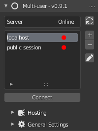

.. _quickstart:

Quick Start
===========

Welcome to the Multi-User manual.
You will find here all the documentation necessary for the good use of the addon: :ref:`index-manual`

First of all, let's have a quick look at the Multi-User features.

Username and color
------------------

When you launch the addon for the first time you can find this panel in the Sidebar of your View3D:

.. figure:: img/first_time_menu.png
   :align: center

1. Choose a **name** and a **color** that will be specific to you and that will allow others to identify you easily once in session. Don't worry, they can be changed at any time in  :menuselection:`Edit --> Prerecences --> Add-ons --> Multi-user` or in  :menuselection:`Multi-User Pannel --> General Settings`.
2. Press **Continue**

Multi-User side pannel
----------------------

Once the Multi-User is launched you will arrive directly on the main menu:

Three panels are at your disposal:

- **Server list**: You can add, delete and edit server presets according to your preferences. At first launch two servers will already be in your preferences: *Public Session*, the public server of the Multi-User Discord, *Localhost*, to connect locally to your server.
- **Hosting**: To locally host a session with a Blender instance.
- **General Settings**: Include advanced addon settings like *user info*, *server ping*, *cache*, etc.

Session management
------------------

The multi-user addon provides a session management system.
In this guide, you will quickly learn how to use the collaborative session management system in three parts:

- :ref:`how-to-join`
- :ref:`how-to-host`
- :ref:`how-to-manage`

For more details on what the addon offers:

.. - :ref: