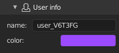
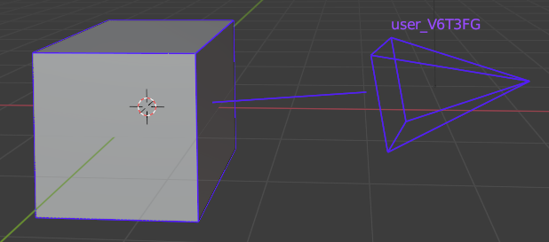
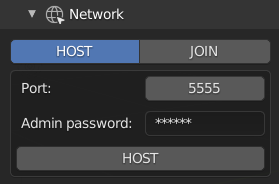
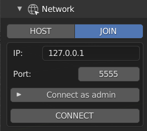
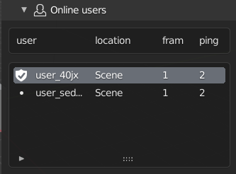
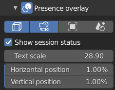
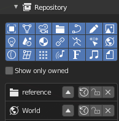
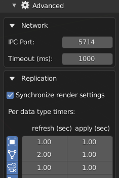

===========
Quick start
===========

.. hint::
   *All settings are located under: `View3D -> Sidebar -> Multiuser panel`*

The multi-user is based on a session management system. Under the 
In this this guide you will learn how to master the collaborative session system in three part:

- :ref:`how-to-host`
- :ref:`how-to-join`
- :ref:`how-to-manage`

.. _how-to-host:

How to host a session
=====================

TODO: Speak about local/DEDICATED HERE

.. _user-info:

-----------------------------
1. Fill your user information
-----------------------------

In the **User Info** panel (See image below) allow you to constomize your online identity.

   User info panel

Let's fill those tow field:

- **name**: your online name.
- **color**: a color used to represent you into other user workspace(see image below).

During online sessions, other users will see your selected object and camera hilghlited in your profile color.

.. _user-representation:

   User viewport representation

--------------------
2. Setup the network
--------------------

When the hosting process will start, the multi-user addon will lauch a local server instance.
The **Host panel**(see image below) allow you to configure this server according to:

* **Port**: Port on wich the server is listening
* **Start from**: The session initialisation method

   * **current scenes**: start with the current blendfile datas
   * **an empty scene**: clear a data and start over
   .. danger::
      By starting from an empty, all of the blend data will be removed !
      Ensure to save your existing work before launching the session.

* **Admin password**: The session administration password

   Host network panel

.. note:: Additionnal configuration setting can be found in the :ref:`advanced` section.

Once everything is setup you can hit the **HOST** button to launch the session !

It will start the server and connect to it in few steps.

.. _how-to-join:

How to join a session
=====================

This section describe how join a session.

-----------------------------
1. Fill your user information
-----------------------------

Follow the user-info_ section for this step.

----------------
2. Network setup
----------------

Connection are done from this panel.

   
IP: server ip
Port: server port 

**Port configuration:**
For now, a session use 4 ports to run.

.. _how-to-manage:

How to manage a session
=======================

This section describe tools available during a collaborative session.

---------------
Connected users
---------------

This panel displays all connected users information's, including yours. 
By selecting a user in the list you'll have access to different **actions**:

- The **camera button** allow you to snap on the user viewpoint.
- The **time button** allow you to snap on the user time.
- The **cross button** [**host only**] allow the admin to kick users

-------------------
Presence show flags 
-------------------

This pannel allow you to tweak users overlay in the viewport:

- **Show selected objects**: display other users current selection
- **Show users**: display users current viewpoint 
- **Show different scenes**: display users on other scenes

---------------------
Replicated properties
---------------------

The **replicated properties** panel shows all replicated properties status and associated actions.
Since the replication architecture is based on commit/push/pull mechanisms, a replicated properties can be pushed/pull or even committed manually from this panel.

+---------------------------------------+-------------------+------------------------------------------------------------------------------------+
| icon                                  | Action            | Description                                                                        |
+=======================================+===================+====================================================================================+
| .. image:: img/quickstart_push.png    |  **Push**         | push data-block to other clients                                                   |
+---------------------------------------+-------------------+------------------------------------------------------------------------------------+
| .. image:: img/quickstart_pull.png    | **Pull**          | pull last version into blender                                                     |
+---------------------------------------+-------------------+------------------------------------------------------------------------------------+
| .. image:: img/quickstart_refresh.png | **Reset**         | Reset local change to the server version                                           |
+---------------------------------------+-------------------+------------------------------------------------------------------------------------+
| .. image:: img/quickstart_unlock.png  | **Lock/Unlock**   | If locked, does nothing. If unlocked, grant modification rights to another user.   |
+---------------------------------------+-------------------+------------------------------------------------------------------------------------+
| .. image:: img/quickstart_remove.png  |  **Delete**       | Remove the data-block from network replication                                     |
+---------------------------------------+-------------------+------------------------------------------------------------------------------------+

.. _advanced:

Advanced configuration
======================

This section contains optionnal settings to configure the session behavior.

**Synchronise render settings** (only host) enable replication of EEVEE and CYCLES render settings to match render between clients.

**Properties frequency gird** allow to set a custom replication frequency for each type of data-block:
- **Refresh**: pushed data update rate (in second)
- **Apply**: pulled data update rate (in second)

.. note:: Per-data type settings will soon be revamped for simplification purposes

