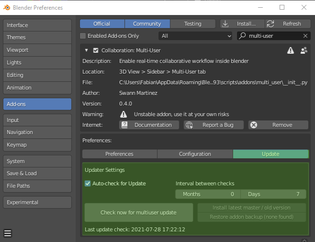
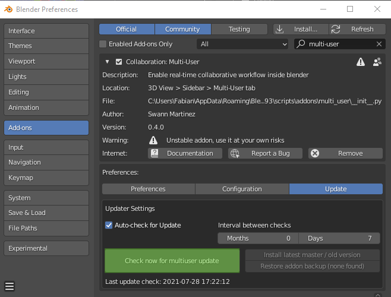
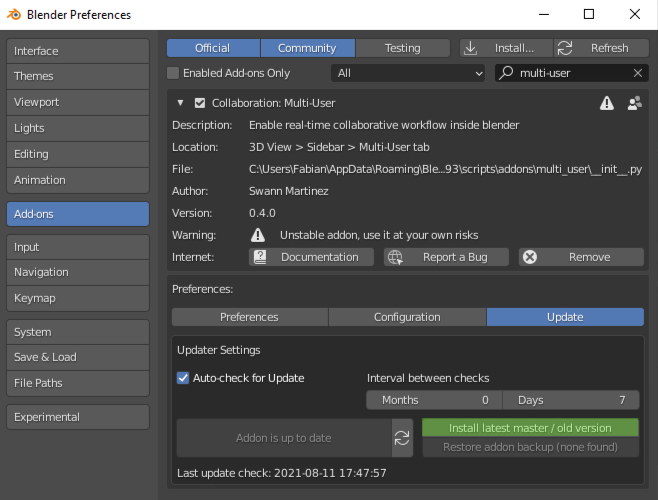
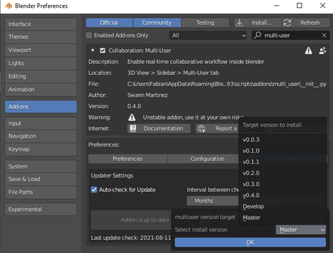
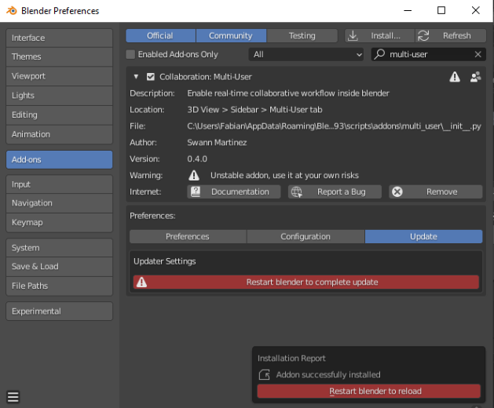

================
Update the Addon
================

Multi-User has a built-in auto-update function in its preferences.

Auto-Update
-----------

1. Enable it by clicking 'Auto-check for Update' and choose the frequency you'd like.
2. **Make sure to click the three bars in the bottom-left, and save this to your preferences**

    Update menu in the addon preferences pannel

Manual Update
-------------

Sometimes you'd like to perform manual update, or even side-grade or rollback your multi-user version. Perhaps you are trying out new features from the 'develop' branch in a test session.

1. Click on 'Check now for multiuser update'. Multi-user will now find new versions

    Check for updates

1. Select 'Install latest master / old version'

    Install

1. In most cases, select 'master' branch for the latest stable release. The unstable 'develop' branch and older releases are available

    Select version

4. Finally, restart blender to use the updated version

    Restart blender

.. toctree::
    :maxdepth: 1