.. _hosting_on_internet:

===================
Hosting on Internet
===================

.. warning::
    Until now, those communications are not encrypted but are planned to be in a mid-term future (`status <https://gitlab.com/slumber/multi-user/issues/62>`_).

This tutorial aims to guide you toward hosting a collaborative multi-user session on the internet.
Hosting a session can be achieved in several ways:

- :ref:`host-blender`: hosting a session directly from the blender add-on panel.
- :ref:`host-dedicated`: hosting a session directly from the command line interface on a computer without blender.
- :ref:`host-cloud`: hosting a session on a dedicated cloud server such as Google Cloud's free tier.

.. _host-blender:

--------------------
From blender
--------------------
By default your router doesn't allow anyone to share you connection.
In order grant the server access to people from internet you have two main option:

* The :ref:`connection-sharing`: the easiest way.
* The :ref:`port-forwarding`: this way is the most unsecure. If you have no networking knowledge, you should definitely follow :ref:`connection-sharing`.

.. _connection-sharing:

Using a connection sharing solution
-----------------------------------

You can either follow `Pierre Schiller's <https://www.youtube.com/c/activemotionpictures/featured>`_ excellent video tutorial or jump to the `text tutorial <zt-installation_>`_.

.. raw:: html

    

    <iframe width="560" height="315" src="https://www.youtube.com/embed/xV4R5AukkVw" frameborder="0" allow="accelerometer; clipboard-write; encrypted-media; gyroscope; picture-in-picture" allowfullscreen></iframe>
    

Many third party software like `ZEROTIER <https://www.zerotier.com/download/>`_ (Free) or `HAMACHI <https://vpn.net/>`_ (Free until 5 users) allow you to share your private network with other people.
For the example I'm gonna use ZeroTier because it's free and open source.

.. _zt-installation:

1. Installation
^^^^^^^^^^^^^^^

Let's start by downloading and installing ZeroTier:
https://www.zerotier.com/download/

Once installed, launch it.

2. Network creation
^^^^^^^^^^^^^^^^^^^

To create a ZeroTier private network you need to register a ZeroTier account `on my.zerotier.com <https://my.zerotier.com/login>`_
(click on **login** then register on the bottom)

Once you account it activated, you can connect to `my.zerotier.com <https://my.zerotier.com/login>`_.
Head up to the **Network** section (highlighted in red in the image below).
 
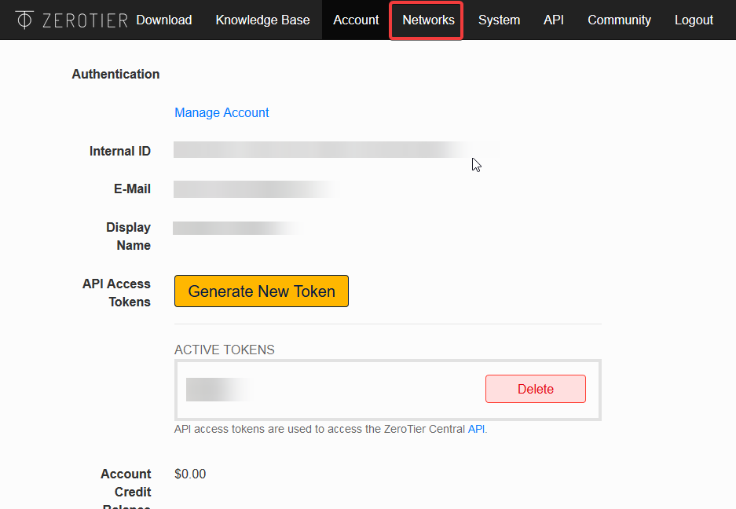

    ZeroTier user homepage

Hit 'Create a network'(see image below) and go to the network settings.

.. figure:: img/hosting_guide_create_network.png
    :align: center
    :width: 450px

    Admin password

Now that the network is created, let's configure it.

In the Settings section(see image below), you can change the network name to what you want.
Make sure that the field **Access Control** is set to **PRIVATE**.

.. hint::
    If you set the Access Control to PUBLIC, anyone will be able to join without
    your confirmation.  It is easier to set up but less secure. 

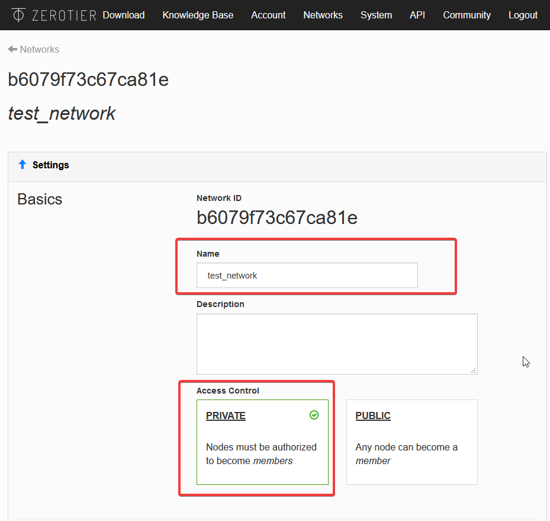

    Network settings

That's all for the network setup !
Now let's connect everyone.

.. _network-authorization:

3. Network authorization
^^^^^^^^^^^^^^^^^^^^^^^^

Since your ZeroTier network is Private, you will need to authorize each new user
to connect to it.
For each user you want to add, do the following step:

1. Get the client **ZeroTier id** by right clicking on the ZeroTier tray icon and click on the `Node ID`, it will copy it.

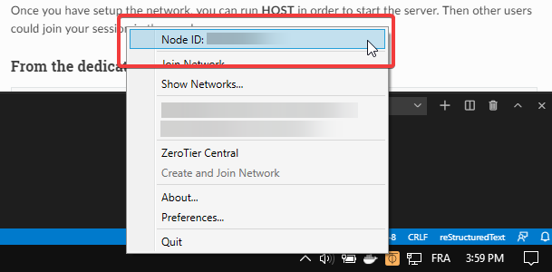

    Get the ZeroTier client id

2. Go to the network settings in the Member section and paste the Node ID into the Manually Add Member field.

.. figure:: img/hosting_guide_add_node.png
    :align: center
    :width: 450px

    Add the client to network-authorized users

4. Network connection
^^^^^^^^^^^^^^^^^^^^^

To connect to the ZeroTier network, get the network id from the network settings (see image).

.. figure:: img/hosting_guide_get_id.png
    :align: center
    :width: 450px

Now we are ready to join the network !
Right click on the ZeroTier tray icon and select **Join Network** ! 

.. figure:: img/hosting_guide_join_network.png
    :align: center
    :width: 450px

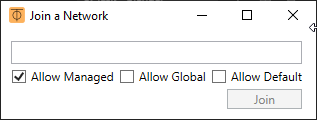

    Joining the network
 
Past the network id and check ``Allow Managed`` then click on join !
You should be connected to the network.

Let's check the connection status. Right click on the tray icon and click on **Show Networks...**.

.. figure:: img/hosting_guide_show_network.png
    :align: center
    :width: 450px

    Show network status

.. figure:: img/hosting_guide_network_status.png
    :align: center

    Network status.

The network status must be **OK** for each user(like in the picture above) otherwise it means that you are not connected to the network.
If you see something like **ACCESS_DENIED**, it means that you were not authorized to join the network. Please check the section :ref:`network-authorization`

This is it for the ZeroTier network setup. Now everything should be setup to use the multi-user add-on over internet ! You can now follow the :ref:`quickstart` guide to start using the multi-user add-on !

.. _port-forwarding:

Using port-forwarding
---------------------

The port forwarding method consists of configuring your network router to deny most traffic with a firewall, but to then allow particular internet traffic (like a multiuser connection) through the firewall on specified ports.

In order to know which ports are used by the add-on, please check the :ref:`port-setup` section.
To set up port forwarding for each port you can follow this `guide <https://www.wikihow.com/Set-Up-Port-Forwarding-on-a-Router>`_ for example.

Once you have set up the network you can follow the :ref:`quickstart` guide to begin using the multi-user add-on !

.. _host-dedicated:

--------------------------
From the dedicated server
--------------------------

.. warning::
    The dedicated server is developed to run directly on an internet server (like a VPS (Virtual Private Server)). You can also run it at home on a LAN but for internet hosting you need to follow the :ref:`port-forwarding` setup first. Please see :ref:`host-cloud` for a detailed walkthrough of cloud hosting using Google Cloud.

The dedicated server allows you to host a session with simplicity from any location.
It was developed to improve internet hosting performance (for example poor latency).

The dedicated server can be run in two ways:

- :ref:`cmd-line`
- :ref:`docker`

.. Note:: There are shell scripts to conveniently start a dedicated server via either of these approaches available in the gitlab repository. See section: :ref:`serverstartscripts`

.. _cmd-line:

Using a regular command line
----------------------------

You can run the dedicated server on any platform by following these steps:

1. Firstly, download and intall python 3 (3.6 or above).
2. Install the latest version of the replication library:

    .. code-block:: bash

        python -m pip install replication==0.1.13

4. Launch the server with:

    .. code-block:: bash

        replication.serve

.. hint::
    You can also specify a custom **port** (-p), **timeout** (-t), **admin password** (-pwd), **log level (ERROR, WARNING, INFO or DEBUG)** (-l) and **log file** (-lf) with the following optional arguments

    .. code-block:: bash

        replication.serve -p 5555 -pwd admin -t 5000 -l INFO -lf server.log

Here, for example, a server is instantiated on port 5555, with password 'admin', a 5 second timeout, and logging enabled.

As soon as the dedicated server is running, you can connect to it from blender by following :ref:`how-to-join`.

.. hint::
    Some server commands are available to enable administrators to manage a multi-user session. Check :ref:`dedicated-management` to learn more.

.. _docker:

Using a pre-configured image on docker engine
---------------------------------------------

Launching the dedicated server from a docker server is simple as running:

.. code-block:: bash

    docker run -d \
        -p 5555-5560:5555-5560 \
        -e port=5555 \
        -e log_level=DEBUG \
        -e password=admin \
        -e timeout=5000 \
        registry.gitlab.com/slumber/multi-user/multi-user-server:latest

Please use the :latest tag, or otherwise use the URL of the most recent container available in the `multi-user container registry <https://gitlab.com/slumber/multi-user/container_registry/1174180>`_. As soon as the dedicated server is running, you can connect to it from blender by following :ref:`how-to-join`.

You can check that your container is running, and find its ID and name with:

.. code-block:: bash

    docker ps

.. _docker-logs:

Viewing logs in a docker container
----------------------------------

Logs for the server running in a docker container can be accessed by outputting the container logs to a log file. First, you'll need to know your container ID, which you can find by running:

.. code-block:: bash

    docker ps

Then, output the container logs to a file:

.. code-block:: bash

    docker logs your-container-id >& dockerserver.log

.. Note:: If using WSL2 on Windows 10 (Windows Subsystem for Linux), it is preferable to run a dedicated server via regular command line approach (or the associated startup script) from within Windows - docker desktop for windows 10 usually uses the WSL2 backend where it is available.

.. This may not be true. Need to write up how to locally start a docker container from WSL2

Downloading logs from a docker container on a cloud-hosted server
-----------------------------------------------------------------

If you'd like to pull the log files from a cloud-hosted server to submit to a developer for review, a simple process using SSH and SCP is as follows:

First SSH into your instance. You can either open the `VM Instances console <https://console.cloud.google.com/compute/instances>`_ and use the browser terminal provided by Google Cloud (I had the best luck using the Google Chrome browser)... or you can see `here <https://cloud.google.com/compute/docs/instances/connecting-advanced#thirdpartytools>`_ for how to set up your instance for SSH access from your local terminal.

If using SSH from your terminal, first generate SSH keys (setting their access permissions to e.g. chmod 400 level whereby only the user has permissions) and submit the public key to the cloud-hosted VM instance, storing the private key on your local machine.
Then, SSH into your cloud server from your local terminal, with the following command:

.. code-block:: bash

    ssh -i PATH_TO_PRIVATE_KEY USERNAME@EXTERNAL_IP_ADDRESS

Use the private key which corresponds to the public key you uploaded, and the username associated with that key (visible in the Google Cloud console for your VM Instance). Use the external IP address for the server, available from the `VM Instances console <https://console.cloud.google.com/compute/instances>`_
e.g.

.. code-block:: bash

    ssh -i ~/.ssh/id_rsa user@xxx.xxx.xxx.xxx

Once you've connected to the server's secure shell, you can generate a log file from the docker container running the replication server. First, you'll need to know your container ID, which you can find by running:

.. code-block:: bash

    docker ps

If you're cloud-hosting with e.g. Google Cloud, your container will be the one associated with the `registry address <https://gitlab.com/slumber/multi-user/container_registry/1174180>`_ where your Docker image was located. e.g. registry.gitlab.com/slumber/multi-user/multi-user-server:latest

To view the docker container logs, run:

.. code-block:: bash

    docker logs your-container-name

OR

.. code-block:: bash

    docker logs your-container-id

To save the output to a file, run:

.. code-block:: bash

    docker logs your-container-id >& dockerserver.log

Now that the server logs are available in a file, we can disconnect from the secure shell (SSH), and then copy the file to the local machine using SCP. In your local terminal, execute the following:

.. code-block:: bash

    scp -i PATH_TO_PRIVATE_KEY USERNAME@EXTERNAL_IP_ADDRESS:"dockerserver.log" LOCAL_PATH_TO_COPY_FILE_TO

e.g.

.. code-block:: bash

    scp -i ~/.ssh/id_rsa user@xxx.xxx.xxx.xxx:"dockerserver.log" .

This copies the file dockerserver.log generated in the previous step to the current directory on the local machine. From there, you can send it to the multi-user maintainers for review.

.. Note:: See these `notes <https://cloud.google.com/compute/docs/containers/deploying-containers?_ga=2.113663175.-1396941296.1606125558#viewing_container_logs>`_ for how to check server logs on Google Cloud using other tools.

.. _serverstartscripts:

Server startup scripts
----------------------

Convenient scripts are available in the Gitlab repository: https://gitlab.com/slumber/multi-user/scripts/startup_scripts/

Simply run the relevant script in a shell on the host machine to start a server with one line of code via replication directly or via a docker container. Choose between the two methods:

    .. code-block:: bash

        ./start-server.sh

or

    .. code-block:: bash

        ./run-dockerfile.sh

.. hint::
    Once your server is up and running, some commands are available to manage the session :ref:`dedicated-management`

.. _dedicated-management:

Dedicated server management
---------------------------

Here is the list of available commands from the dedicated server:

- ``help`` or ``?``: Show all commands. Or, use ``help <command>`` to learn about another command
- ``exit`` or ``Ctrl+C`` : Stop the server.
- ``kick username``: kick the provided user.
- ``users``: list all online users.

Also, see :ref:`how-to-manage` for more details on managing a server.

.. _cloud-dockermanage:

Managing a docker server from the command line
----------------------------------------------
If you want to be able to manage a server running within a docker container, open the terminal on the host machine (or SSH in, if you are using cloud hosting), and then run 

.. code-block:: bash

    docker ps
    
to find your container id, and then

.. code-block:: bash

    docker attach your-container-id
    
to attach to the STDOUT from the container. There, you can issue the server management commands detailed in :ref:`dedicated-management`. Type ``?`` and hit return/enter to see the available commands. Also, see :ref:`how-to-manage` for more details on managing a server.

.. _port-setup:

----------
Port setup
----------

The multi-user network architecture is based on a client-server model. The communication protocol uses four ports to communicate with clients:

* Commands: command transmission (such as **snapshots**, **change_rights**, etc.) [user-nominated port]
* Subscriber : pull data [Commands port + 1]
* Publisher : push data [Commands port + 2]
* TTL (time to leave) : used to ping each client [Commands port + 3]

To know which ports will be used, you just have to read the port in your preferences.

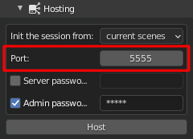

    Port in host settings

In the picture below we have setup our port to **5555** so the four ports will be:

* Commands: **5555** (5555)
* Subscriber: **5556** (5555 +1)
* Publisher: **5557** (5555 +2)
* TTL: **5558** (5555 +3)

Those four ports need to be accessible from the client otherwise multi-user won't work at all !

.. _host-cloud:

-------------------------
Cloud Hosting Walkthrough
-------------------------

The following is a walkthrough for how to set up a multi-user dedicated server instance on a cloud hosting provider - in this case, `Google Cloud <https://www.cloud.google.com>`_. Google Cloud is a powerful hosting service with a worldwide network of servers. It offers a free trial which provides free cloud hosting for 90 days, and then a free tier which runs indefinitely thereafter, so long as you stay within the `usage limits <https://cloud.google.com/free/docs/gcp-free-tier#free-tier-usage-limits>`_. ^^Thanks to community member @NotFood for the tip!

Cloud hosting is a little more complicated to set up, but it can be valuable if you are trying to host a session with multiple friends scattered about planet earth. This can resolve issues with data replication or slowdowns due to poor latency of some users (high ping). This guide may seem technical, but if you follow the steps, you should be able to succeed in hosting an internet server to co-create with other multi-user creators around the world.

Setup Process
-------------

1. Sign Up for Google Cloud
^^^^^^^^^^^^^^^^^^^^^^^^^^^

Let's start by activating an account with Google Cloud. Go to https://www.cloud.google.com and click 'Get Started For Free'

.. figure:: img/hosting_guide_gcloud_1.jpg
    :align: center
    :width: 450px

Google will ask you to login/signup, and to set up a billing account (Don't worry. It will not be charged unless you explicitly enable billing and then run over your `free credit allowance <https://cloud.google.com/free/docs/gcp-free-tier>`_). You will need to choose a billing country (relevant for `tax purposes <https://cloud.google.com/billing/docs/resources/vat-overview>`_). You will choose your server location at a later step.

2. Enable Billing and Compute Engine API
^^^^^^^^^^^^^^^^^^^^^^^^^^^^^^^^^^^^^^^^

From here on, we will mostly stick to the instructions provided `here <https://cloud.google.com/compute/docs/quickstart-linux>`_. Nevertheless, the instructions for multi-user specifically are as follows.

In order to set up a Virtual Machine (VM) to host your server, you will need to enable the billing account which was created during your signup process. From your `console <https://console.cloud.google.com/getting-started>`_, click on 'Go to Checklist' and then 'Create a Billing Account', following the prompts to choose the billing account that was created for you upon signup.

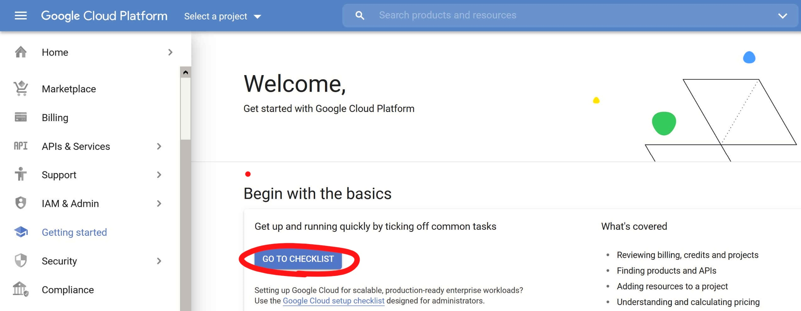

.. figure:: img/hosting_guide_gcloud_3.jpg
    :align: center
    :width: 300px

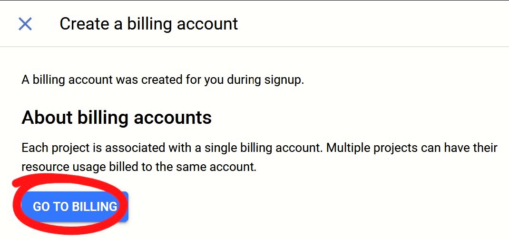

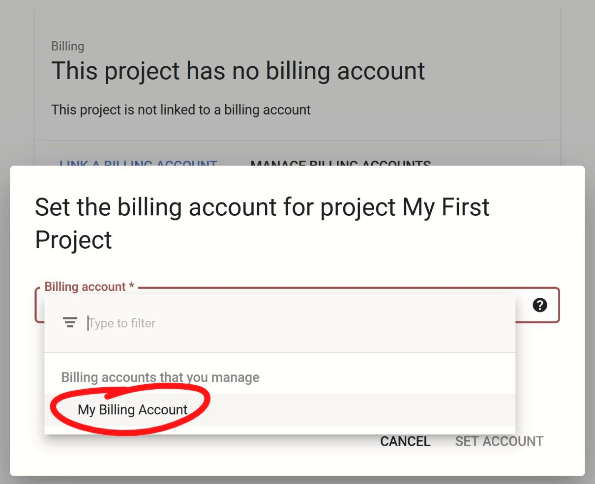

.. figure:: img/hosting_guide_gcloud_6.jpg
    :align: center
    :width: 300px

Now hit 'Set Account', and go back to your `console <https://console.cloud.google.com/getting-started>`_.

Now enable the Compute Engine API. Click `here <https://console.cloud.google.com/apis/api/compute.googleapis.com/overview>`_ to enable.

.. figure:: img/hosting_guide_gcloud_7.jpg
    :align: center
    :width: 300px

3. Create a Linux Virtual Machine Instance
^^^^^^^^^^^^^^^^^^^^^^^^^^^^^^^^^^^^^^^^^^
Continue following the `instructions <https://cloud.google.com/compute/docs/quickstart-linux#create_a_virtual_machine_instance>`_ to create a VM instance. However, once you've finished step 2 of 'Create a virtual machine instance', use the settings and steps for multi-user as follows.

.. _server-location:

3.1 Choose a Server Location
^^^^^^^^^^^^^^^^^^^^^^^^^^^^

The most important settings which you will need to choose for your specific case are the server Region and Zone. You must choose a location which will provide the best ping for all of your fellow creators.

All you need to know is that you'll probably want to choose a location near to where most of your collaborators are located. If your friends are spread out, somewhere in the middle which distributes the ping evenly to all users is best.

You can use `this map <https://cloud.google.com/about/locations/>`_ to make a rough guess of the best server location, if you know your friends' locations.

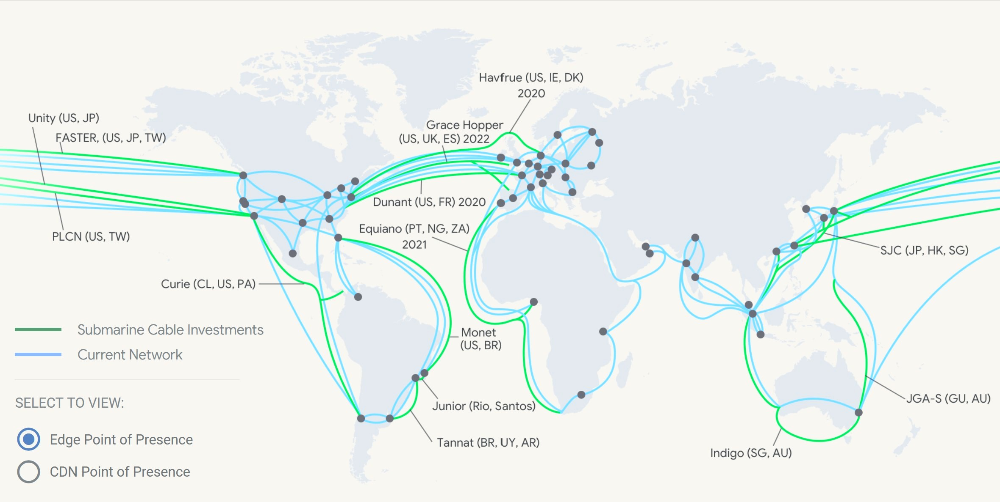

A much better approach is to have your users run a ping test for Google Cloud's servers at https://www.gcping.com/

Have your collaborators open this webpage from their fastest browser, and press the play button. The play button turns to a stop icon while the ping test is running. When it is complete, the play button returns. You may need to refresh your browser to get this to work. You can replay the test to add more server locations to the scan, and stop when you are satisfied that the results are consistent.

Now, gather your friends' data, and work down each user's list from the top, until you find the first location which gives roughly the same ping for all users.

In general, global (using load balancing) will provide the best results, but beyond that, the US Central servers e.g. IOWA generally turn out best for a globally distributed bunch of creators. When in doubt, choose between the servers offered under the `free tier <https://cloud.google.com/free/docs/gcp-free-tier>`_

- Oregon: *us-west1*
    
- Iowa: *us-central1*
    
- South Carolina: *us-east1*

For the following example, the server which gave the most balanced, and lowest average ping between two friends based in Europe and Australia was in Iowa. Salt Lake City would also be an excellent choice.

.. figure:: img/hosting_guide_gcloud_10.jpg
    :align: center
    :width: 450px

    Left - European User | Right - Australian User

Now, input this server location in the 'Region' field for your instance, and leave the default zone which is then populated.

.. Note:: You can read `here <https://cloud.google.com/solutions/best-practices-compute-engine-region-selection>`_ for a deeper understanding about how to choose a good server location.

3.2 Configure the VM
^^^^^^^^^^^^^^^^^^^^

You can deploy the replication server to your VM in either of the ways mentioned at :ref:`host-dedicated`. That is, you can set it up :ref:`cmd-line` or :ref:`docker`. We will go through both options in this walkthrough. See :ref:`container_v_direct` for more details on how to choose. Deploying a container is the recommended approach.

.. _cloud-container:

Option 1 - Deploy a container
^^^^^^^^^^^^^^^^^^^^^^^^^^^^^

If you are familiar with Docker, you'll appreciate that it makes life a little simpler for us. While configuring your instance, you can check **Deploy a container to this VM instance** and copy in the URL of the latest docker image available from the `multi-user container registry <https://gitlab.com/slumber/multi-user/container_registry/1174180>`_ to the *Container image* field, or use the tag ``:latest``

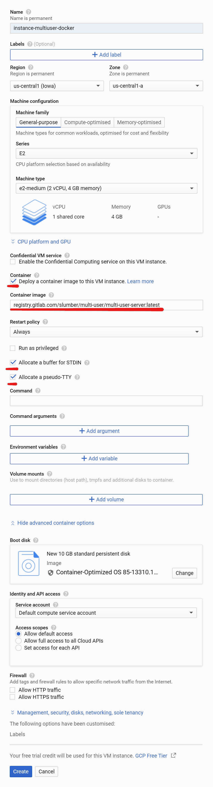
    
    Your configuration with Docker should look like this

Make sure to choose the amount of memory you'd like your server to be able to handle (how much memory does your blender scene require?). In this example, I've chosen 4GB of RAM.

Click on **Advanced container options** and turn on *Allocate a buffer for STDIN* and *Allocate a pseudo-TTY* just in case you want to run an interactive shell in your container.

.. _cloud-optional-parameters:

Optional server parameters
^^^^^^^^^^^^^^^^^^^^^^^^^^

The default Docker image essentially runs the equivalent of:

    .. code-block:: bash

        replication.serve -pwd admin -p 5555 -t 5000 -l DEBUG -lf multiuser_server.log

This means the server will be launched with 'admin' as the administrator password, run on ports 5555:5558, use a timeout of 5 seconds, verbose 'DEBUG' log level, and with log files written to 'multiuser_server.log'. See :ref:`cmd-line` for a description of optional parameters.

.. Note:: If you'd like to configure different server options from the default docker configuration, you can insert your options here by expanding 'Advanced container options' 

For example, I would like to launch my server with a different administrator password than the default, my own log filename, and a shorter 3-second (3000ms) timeout. I'll click *Add argument* under **Command arguments** and paste the following command with options into the "command arguments" field:

    .. code-block:: bash
        
        replication.serve -pwd supersecretpassword -p 5555 -t 3000 -l DEBUG -lf logname.log

Now, my configuration should look like this:

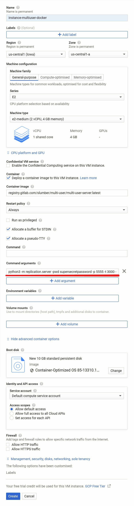

The rest of the settings are now complete. Hit **Create** and your instance will go live. If you've taken this approach, you're already almost there! Skip to :ref:`cloud-firewall`.

.. hint:: You can find further information on configuration options `here <https://cloud.google.com/compute/docs/containers/configuring-options-to-run-containers>`_. Also, see these `notes <https://cloud.google.com/compute/docs/containers/deploying-containers?_ga=2.113663175.-1396941296.1606125558#viewing_container_logs>`_ for other options when deploying your server inside a container, including how to access the server's logs.

.. _cloud-direct:

Option 2 - Over SSH
^^^^^^^^^^^^^^^^^^^

Otherwise, we can run the dedicated server ourselves from the command-line over SSH.

While creating your instance, keep the default settings mentioned in the `guide <https://cloud.google.com/compute/docs/quickstart-linux#create_a_virtual_machine_instance>`_, however at step 4, choose Debian version 10. Also, there is no need to enable HTTP so skip step 6.

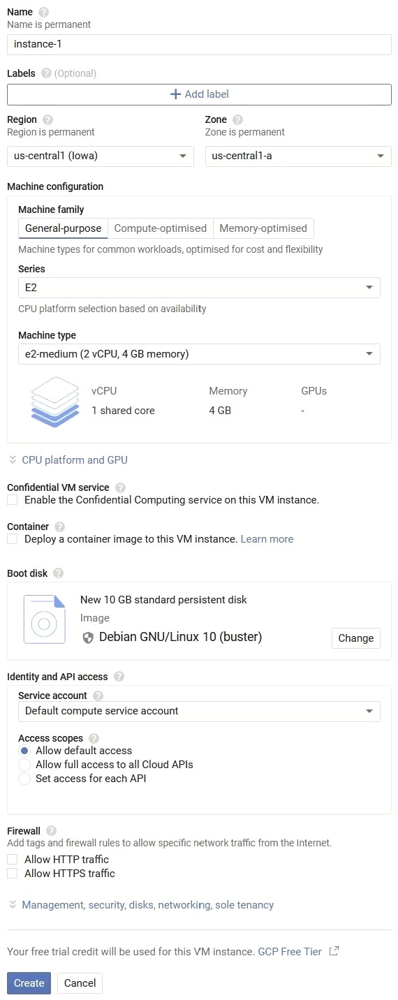

    Your configuration should look like this

Make sure to choose the amount of memory you'd like your server to be able to handle (how much memory does your blender scene require?). In this example, I've chosen 4GB of RAM.

Now, finally, click 'Create' to generate your Virtual Machine Instance.

.. _cloud-firewall:

4. Setting up Firewall and opening Ports
----------------------------------------

Now that your VM is instanced, you'll need to set up firewall rules, and open the ports required by multi-user. The documentation for VM firewalls on google cloud is `here <https://cloud.google.com/vpc/docs/using-firewalls#listing-rules-vm>`_.

First, go to the dashboard showing your `VM instances <https://console.cloud.google.com/compute/instances>`_ and note the 'External IP' address for later. This is the address of your server. Then, click 'Set up Firewall Rules'.

.. figure:: img/hosting_guide_gcloud_11.jpg
    :align: center
    :width: 450px

    Note down your External IP

Now you will need to create two rules. One to enable communication inbound to your server (ingress), and another to enable outbound communication from your server (egress). Click 'Create Firewall'

.. figure:: img/hosting_guide_gcloud_12.jpg
    :align: center
    :width: 450px

Now create a rule exactly as in the image below for the outbound communication (egress).

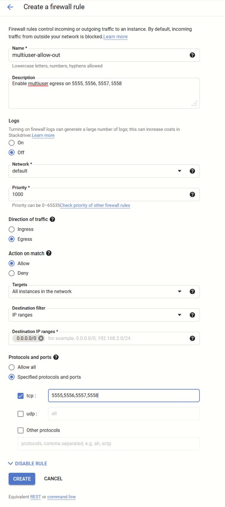
    
    Egress

.. Note:: If you set a different port number in :ref:`cloud-optional-parameters`, then use the ports indicated in :ref:`port-setup`

And another rule exactly as in the image below for the inbound communication (ingress).

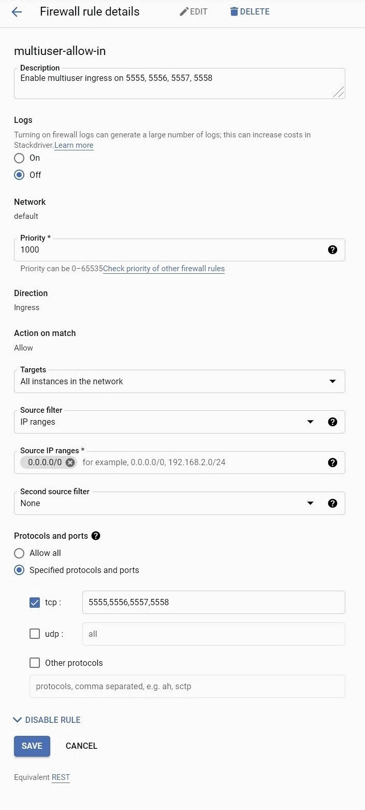

    Ingress

Finally, your firewall configuration should look like this.

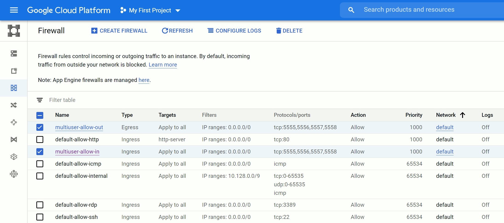

    Final Firewall Configuration

5. Install Replication Server into Virtual Machine
--------------------------------------------------

.. Note:: Skip to :ref:`initialise-server` if you've opted to launch the server by deploying a container. Your server is already live!

Now that we have set up our Virtual Machine instance, we can SSH into it, and install the Replication Server. Open the `VM Instances console <https://console.cloud.google.com/compute/instances>`_ once more, and SSH into your instance. It's easiest to use the browser terminal provided by Google Cloud (I had the best luck using the Google Chrome browser), but you can also see `here <https://cloud.google.com/compute/docs/instances/connecting-advanced#thirdpartytools>`_ for how to set up your instance for SSH access from your terminal.

.. figure:: img/hosting_guide_gcloud_16.jpg
    :align: center
    :width: 450px

Now, a terminal window should pop up in a new browser window looking something like this:

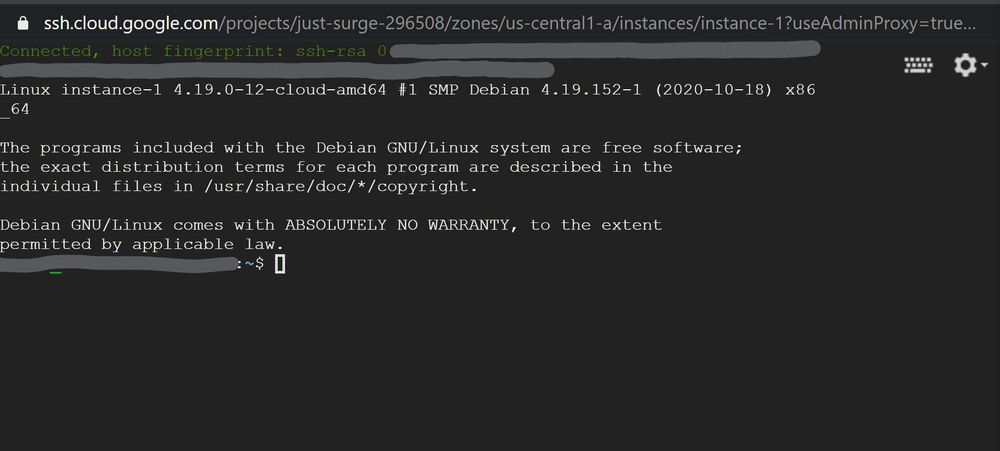

Remember, you had set up the VM with Debian 10. This comes with Python 3.7.3 already installed. The only dependency missing is to set up pip3. So, run:

    .. code-block:: bash
        
        sudo apt install python3-pip

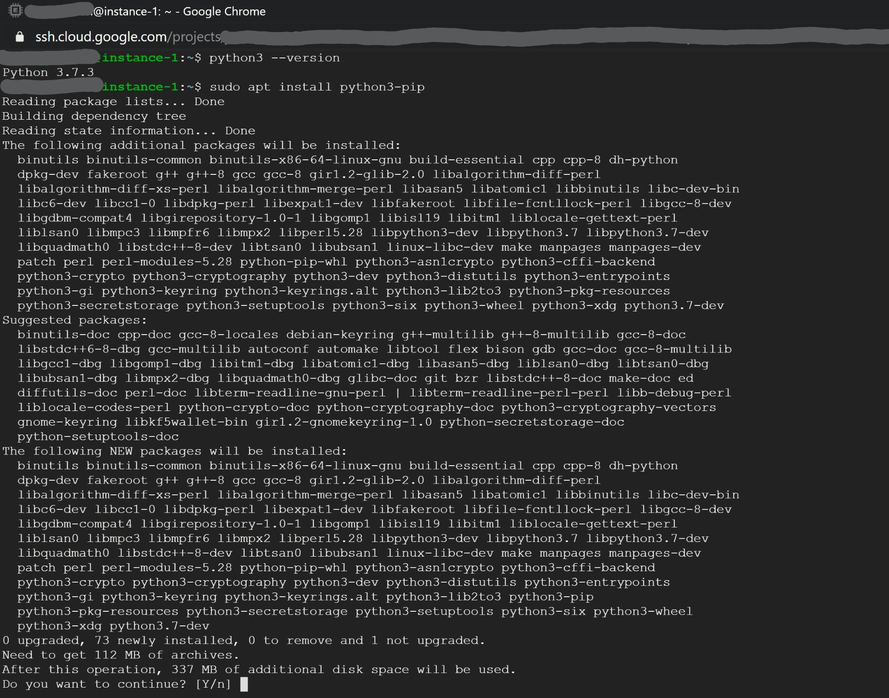

And now lets install the latest version of replication:

    .. code-block:: bash
        
        sudo pip3 install replication==0.1.13

6. Launch Replication Server on VM Instance
-------------------------------------------

We're finally ready to launch the server. Simply run:

    .. code-block:: bash
        
        replication.serve -p 5555 -pwd admin -t 5000 -l INFO -lf server.log

See :ref:`cmd-line` for a description of optional parameters

And your replication server is live! It should stay running in the terminal window until you close it. Copy the external IP that you noted down earlier, available `here <https://console.cloud.google.com/networking/addresses/list>`_ and now you can open Blender and connect to your server!

.. _initialise-server:

7. Initialise your Server in Blender
------------------------------------

Once in Blender, make sure your multi-user addon is updated to the latest version. :ref:`update-version`. Then, follow the instructions from :ref:`how-to-join` and connect as an admin user, using the password you launched the server with and the IP adress of the server. Then, click *connect*.

Now as the admin user, you can click on *init* and choose whether to initialise the server with a preloaded scene, or an empty scene.

Now your session is live!

If you made it this far, congratulations! You can now go ahead and share the external IP address with your friends and co-creators and have fun with real-time collaboration in Blender!

Hopefully, your cloud server setup has improved your group's overall ping readings, and you're in for a smooth and trouble-free co-creation session.

.. Note:: If you should so desire, pay attention to your credit and follow the steps `here <https://cloud.google.com/compute/docs/quickstart-linux#clean-up>`_ to close your instance at your discretion.

.. _container_v_direct:

Should I deploy a Docker Container or launch a server from Linux VM command-line?
------------------------------------------------------

- Directly from Linux VM - This approach gives you control over your session more easily. However, your server may time out once your SSH link to the server is interrupted (for example, if the admin's computer goes to sleep).
- Deploy a Docker Container - This is the recommended approach. This approach is better for leaving a session running without supervision. It can however be more complicated to manage. Use this approach if you'd like a consistent experience with others in the multi-user community, pulling from the most up-to-date docker image maintained by @swann in the multi-user container registry.