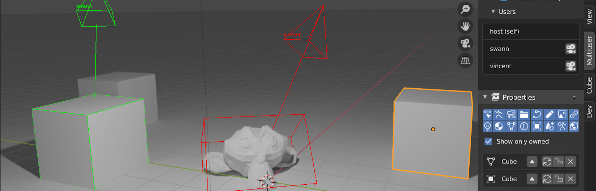

.. _index-manual:

=====================================
Multi-user 0.5.0 Reference Manual
=====================================

Welcome to the manual of the Multi-user, a free and open source blender addon. It tool aims to bring multiple users to work on the same .blend over the network.

Join our `discord server <https://discord.gg/aBPvGws>`_ to get help and join collaborative creation sessions.

.. warning:: Still under development

Getting started
===============

.. only:: builder_html and (not singlehtml)

    .. container:: tocdescr

        .. container:: descr

            :doc:`about/index`

        .. container:: descr
   
            :doc:`getting_started/install`

        .. container:: descr
       
            :doc:`getting_started/quickstart`
        
        .. container:: descr
       
            :doc:`troubleshooting/index`

Sections
=========

.. only:: builder_html and (not singlehtml)

   .. container:: tocdescr

      .. container:: descr

         .. figure:: /img/index_ui.png
            :target: ui/index.html

         :doc:`/ui/index`
            An introduction to Multi-User's interface.

      .. container:: descr

         .. figure:: /img/index_advanced.png
            :target: advanced/index.html

         :doc:`/advanced/index`
            Overview of the advanced settings.

      .. container:: descr

         .. figure:: /img/index_hosting_internet.png
            :target: hosting_internet/index.html

         :doc:`/hosting_internet/index`
            A tutorial to host a collaborative Multi-User session on the internet.

      .. container:: descr

         .. figure:: /img/index_workflow.png
            :target: workflow/index.html

         :doc:`/workflow/index`
            A guide to understand collaborative workflow in 3D.

.. only:: latex or epub or singlehtml

    .. toctree::
        :maxdepth: 1
    
        about/index.rst
        getting_started/index.rst
        ui/index.rst
        advanced/index.rst
        hosting_internet/index.rst
        workflow/index.rst
        troubleshooting/index.rst
        ways_to_contribute/index.rst
        glossary/index.rst

