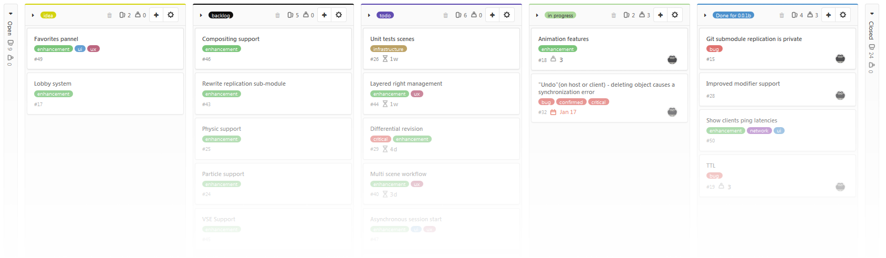

=====================================
Welcome to Multi-user's documentation
=====================================

.. image:: img/homepage_ban.png

The multi-user addon is a free and open source blender plugin. It tool aims to bring multiple users to work on the same .blend over the network.

.. warning::  Under development, use it at your own risks.

Main Features
=============

- Collaborative workflow in blender
- Viewport users presence (active selection, POV)
- Datablocks right managment
- Tested under Windows 

Community
=========

A `discord server <https://discord.gg/aBPvGws>`_ have been created to provide help for new users and 
organize collaborative creation sessions.

Status
======

Follow the `roadmap <https://gitlab.com/slumber/multi-user/-/boards/929107>`_ to be aware of last news.

Documentation is organized into the following sections:

.. toctree::
    :maxdepth: 1
    :caption: About
    :name: sec-about

    about/introduction

.. toctree::
    :maxdepth: 1
    :caption: Getting started
    :name: sec-learn
    
    getting_started/install
    getting_started/quickstart
    getting_started/glossary

.. toctree::
   :maxdepth: 1
   :caption: Tutorials
   :name: sec-tutorials

   tutorials/hosting_guide

.. toctree::
    :maxdepth: 1
    :caption: Community
    :name: sec-community
    
    ways_to_contribute