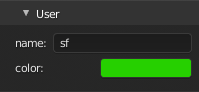
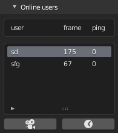

===========
Quick start
===========

*All settings are located under: `View3D -> Sidebar -> Multiuser panel`*

Session setup
=============
This section describe how to create or join a session.

---------------------
1. User information's
---------------------

- **name**: username.
- **color**: color used to represent the user into other user workspace.

----------
2. Network
----------

.. note:: If you host a session over internet, special network configuration is needed. 

Hosting and connection are done from this panel.
 
+-----------------------------------+-------------------------------------+
| Host                              | Join                                |
+===================================+=====================================+
|.. image:: img/quickstart_host.png | .. image:: img/quickstart_join.png  |
+-----------------------------------+-------------------------------------+
| | Start empty: Cleanup the file   | | IP: server ip                     |
| | before hosting                  | | Port: server port                 |
+-----------------------------------+-------------------------------------+
|  **HOST**: Host a session         | **CONNECT**: Join a session         |
+-----------------------------------+-------------------------------------+

**Port configuration:**
For now, a session use 4 ports to run.
If 5555 is given in host settings, it will use 5555, 5556 (5555+1), 5557 (5555+2), 5558 (5555+3). 

------------
2.1 Advanced
------------

.. image:: img/quickstart_advanced.png

**Right strategy** (only host) enable you to choose between a strict and a relaxed pattern:

- **Strict**: Host is the king, by default the host own each properties, only him can grant modification rights.
- **Common**: Each properties are under common rights by default, on selection, a property is only modifiable by the owner.
  
On each strategy, when a user is the owner he can choose to pass his rights to someone else.

**Properties frequency gird** allow to set a custom replication frequency for each type of data-block:

- **Refresh**: pushed data update rate (in second)
- **Apply**: pulled data update rate (in second)

.. note:: Per-data type settings will soon be revamped for simplification purposes

Session Management
==================

---------------
Connected users
---------------

This panel displays all connected users information's, including yours. 
By selecting a user in the list you'll have access to different **actions**:

- The **camera button** allow you to snap on the user viewpoint.
- The **time button** allow you to snap on the user time.

---------------------
Replicated properties
---------------------

.. image:: img/quickstart_properties.png

The **replicated properties** panel shows all replicated properties status and associated actions.
Since the replication architecture is based on commit/push/pull mechanisms, a replicated properties can be pushed/pull or even committed manually from this panel.

+---------------------------------------+-------------------+------------------------------------------------------------------------------------+
| icon                                  | Action            | Description                                                                        |
+=======================================+===================+====================================================================================+
| .. image:: img/quickstart_push.png    |  **Push**         | push data-block to other clients                                                   |
+---------------------------------------+-------------------+------------------------------------------------------------------------------------+
| .. image:: img/quickstart_pull.png    | **Pull**          | pull last version into blender                                                     |
+---------------------------------------+-------------------+------------------------------------------------------------------------------------+
| .. image:: img/quickstart_refresh.png | **Reset**         | Reset local change to the server version                                           |
+---------------------------------------+-------------------+------------------------------------------------------------------------------------+
| .. image:: img/quickstart_unlock.png  | **Lock/Unlock**   | If locked, does nothing. If unlocked, grant modification rights to another user.   |
+---------------------------------------+-------------------+------------------------------------------------------------------------------------+
| .. image:: img/quickstart_remove.png  |  **Delete**       | Remove the data-block from network replication                                     |
+---------------------------------------+-------------------+------------------------------------------------------------------------------------+

