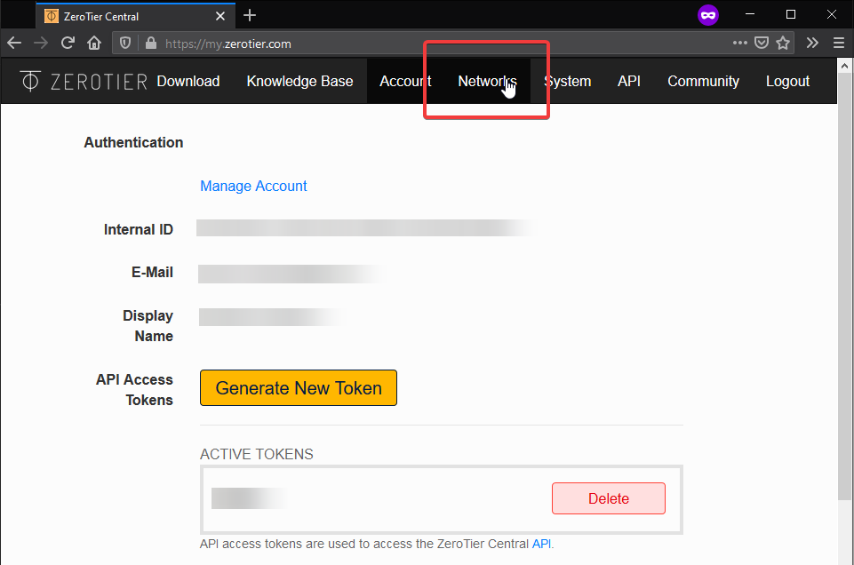
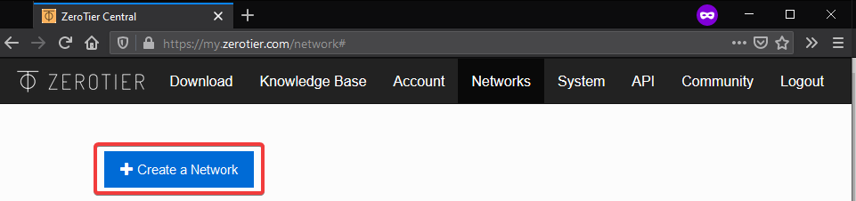
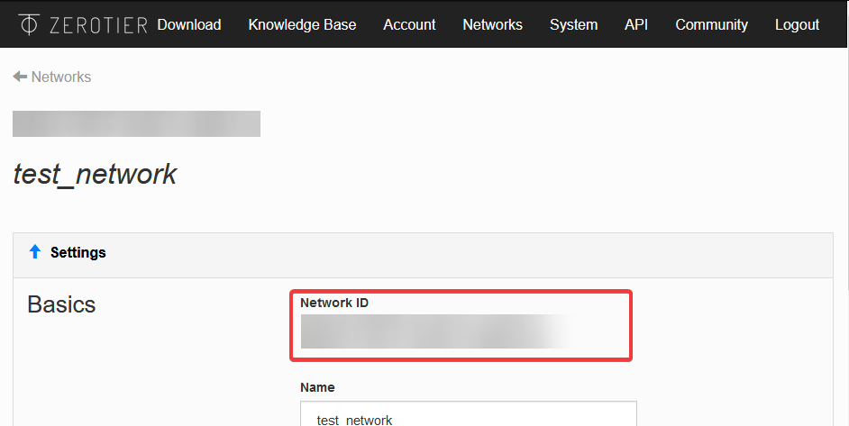
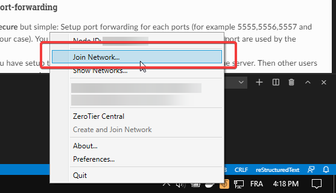
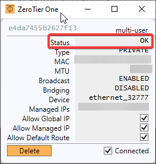
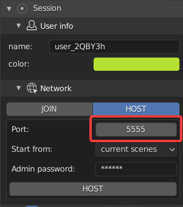

.. _internet-guide:

===================
Hosting on internet
===================

.. warning::
    Until now, those communications are not encrypted but are planned to be in a mid-term future (`Status <https://gitlab.com/slumber/multi-user/issues/62>`_).

This tutorial aims to guide you to host a collaborative Session on internet.
Hosting a session can be done is several ways:

- :ref:`host-blender`: hosting a session directly from the blender add-on panel.
- :ref:`host-dedicated`: hosting a session directly from the command line interface on a computer without blender.

.. _host-blender:

-------------
From blender
-------------
By default your router doesn't allow anyone to share you connection.
In order grant server access to people from internet you have tow main option:

* The :ref:`connection-sharing`: the easiest way.
* The :ref:`port-forwarding`: this one is the most unsecure, if you have no networking knowledge, you should definitively go to :ref:`connection-sharing`.

.. _connection-sharing:

Using a connection sharing solution
-----------------------------------

Many third party software like `ZEROTIER <https://www.zerotier.com/download/>`_ (Free) or `HAMACHI <https://vpn.net/>`_ (Free until 5 users) allow you to share your private network with other people.
For the example I'm gonna use ZeroTier because its free and open source.

1. Installation
^^^^^^^^^^^^^^^

Let's start by downloading and installing ZeroTier:
https://www.zerotier.com/download/

Once installed, launch it.

2. Network creation
^^^^^^^^^^^^^^^^^^^

To create a ZeroTier private network you need to register a ZeroTier account `on my.zerotier.com <https://my.zerotier.com/login>`_
(click on **login** then register on the bottom)

Once you account it activated, you can connect to `my.zerotier.com <https://my.zerotier.com/login>`_.
Head up to the **Network** section(highlighted in red in the image below).

    ZeroTier user homepage

Hit 'Create a network'(see image below) and go to the network settings.

    Network page

Now that the network is created, let's configure it.

In the Settings section(see image below), you can change the network name to what you want.
Make sure that the field **Access Control** is set to **PRIVATE**.

.. hint::
    If you set the Access Control to PUBLIC, anyone will be able to join without
    your confirmation.  It is easier to set up but less secure. 

.. figure:: img/hosting_guide_network_settings.png
    :align: center
    :width: 450px

    Network settings

That's all for the network setup !
Now let's connect everyone.

.. _network-authorization:

3. Network authorization
^^^^^^^^^^^^^^^^^^^^^^^^

Since your ZeroTier network is Private, you will need to authorize each new users
to connect to it.
For each user you want to add, do the following step:

1. Get the client **ZeroTier id** by right clicking on the ZeroTier tray icon and click on the `Node ID`, it will copy it.

.. figure:: img/hosting_guide_get_node.png
    :align: center
    :width: 450px

    Get the ZeroTier client id

2. Go to the network settings in the Member section and paste the Node ID into the Manually Add Member field.

.. figure:: img/hosting_guide_add_node.png
    :align: center
    :width: 450px

    Add the client to network authorized users

4. Network connection
^^^^^^^^^^^^^^^^^^^^^

To connect to the ZeroTier network, get the network id from the network settings (see image).

Now we are ready to join the network !
Right click on the ZeroTier tray icon and select **Join Network** ! 

.. figure:: img/hosting_guide_join.png
    :align: center

    Joining the network
 
Past the network id and check ``Allow Managed`` then click on join !
You should be connected to the network.

Let's check the connection status. Right click on the tray icon and click on **Show Networks...**.

.. figure:: img/hosting_guide_show_network.png
    :align: center
    :width: 450px

    Show network status

    Network status.

The network status must be **OK** for each user(like in the picture above) otherwise it means that you are not connected to the network.
If you see something like **ACCESS_DENIED**, it means that you were not authorized to join the network. Please check the :ref:`network-authorization` section.

This is it for the ZeroTier network setup. Now everything should be setup to use the multi-user add-on over internet ! You can now follow the :ref:`quickstart` guide to start using the multi-user add-on !

.. _port-forwarding:

Using port-forwarding
---------------------

The port forwarding method consist to configure you Network route to allow internet trafic throught specific ports.

In order to know which port are used by the add-on, check the :ref:`port-setup` section.
To set up port forwarding for each port you can follow this `guide <https://www.wikihow.com/Set-Up-Port-Forwarding-on-a-Router>`_ for example.

Once you have set up the network you can follow the :ref:`quickstart` guide to start using the multi-user add-on !

.. _host-dedicated:

--------------------------
From the dedicated server
--------------------------

.. warning::
    The dedicated server is developed to run directly on internet server (like VPS). You can also
    run it at home for LAN but for internet hosting you need to follow the :ref:`port-forwarding` setup first.  

The dedicated server allow you to host a session with simplicity from any location.
It was developed to improve intaernet hosting performance.

The dedicated server can be run in tow ways:

- :ref:`cmd-line`
- :ref:`docker`

.. _cmd-line:

Using a regular command line
----------------------------

You can run the dedicated server on any platform by following those steps:

1. Firstly, download and intall python 3 (3.6 or above).
2. Download and extract the dedicated server from `here <https://gitlab.com/slumber/replication/-/archive/develop/replication-develop.zip>`_
3. Open a terminal in the extracted folder and install python dependencies by running:

    .. code-block:: bash

        python -m pip install -r requirements.txt

4. Launch the server from the same terminal with:

    .. code-block:: bash

        python scripts/server.py

.. hint::
    You can also specify a custom **port** (-p), **timeout** (-t) and **admin password** (-pwd) with the following optionnal argument

    .. code-block:: bash

        python scripts/server.py -p 5555 -pwd toto -t 1000

As soon as the dedicated server is running, you can connect to it from blender (follow :ref:`how-to-join`).

.. hint::
    Some commands are available to manage the session. Check :ref:`dedicated-management` to learn more.

.. _docker:

Using a pre-configured image on docker engine
---------------------------------------------

Launching the dedicated server from a docker server is simple as:

.. code-block:: bash

    docker run -d \
        -p 5555-5560:5555-5560 \
        -e port=5555 \
        -e password=admin \
        -e timeout=1000 \
        registry.gitlab.com/slumber/multi-user/multi-user-server:0.0.3

As soon as the dedicated server is running, you can connect to it from blender.
You can check the :ref:`how-to-join` section.

.. hint::
    Some commands are available to manage the session. Check :ref:`dedicated-management` to learn more.

.. _dedicated-management:

Dedicated server management
---------------------------

Here is the list of available commands from the dedicated server:

- ``help``: Show all commands.
- ``exit`` or ``Ctrl+C`` : Stop the server.
- ``kick username``: kick the provided user.
- ``users``: list all online users.

.. _port-setup:

----------
Port setup
----------

The multi-user network architecture is based on a clients-server model. The communication protocol use four ports to communicate with client:

* Commands: command transmission (such as **snapshots**, **change_rights**, etc.) [given port]
* Subscriber : pull data [Commands port + 1]
* Publisher : push data [Commands port + 2]
* TTL (time to leave) : used to ping each client [Commands port + 3]

To know which ports will be used, you just have to read the port in your preference.

    Port in host settings
In the picture below we have setup our port to **5555** so it will be:

* Commands: 5555 (**5555**)
* Subscriber: 5556 (**5555** +1)
* Publisher: 5557 (**5555** +2)
* TTL: 5558 (**5555** +3)

Those four ports need to be accessible from the client otherwise it won't work at all !