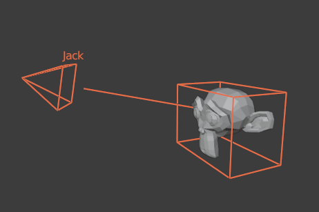
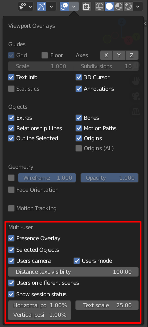

###############
User Interface
###############

General Pannels
===============

To understand the UI of the addon's pannels, see: :ref:`quickstart` (+how to join/host/manage).
In addition to presenting the UI, it explains how to use it.

Presence
=========

*Presence* is the multi-user module responsible for displaying user presence. During the session,
it draw users' related information in your viewport such as:

* Username
* User point of view
* User active mode
* User selection

   Presence overlay

Presence settings
-----------------

The presence overlay panel allows you to enable/disable 
various drawn parts via the following flags:

   Presence overlay settings

- **Presence Overlay**: display presence overlay
- **Selected objects**: display other users' current selections
- **Users camera**: display users' current viewpoint 
- **Users mode**: display users' current mode
- **Distance text visibility**: display text of the overlay at this maximal distance
- **Users on different scenes**: display users working on other scenes
- **Show session status**: display the session status in the viewport 
  
    * **Vertical/Horizontal position**: session position in the viewport
    * **Text scale**: session status text size

